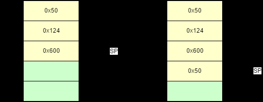
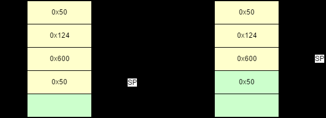
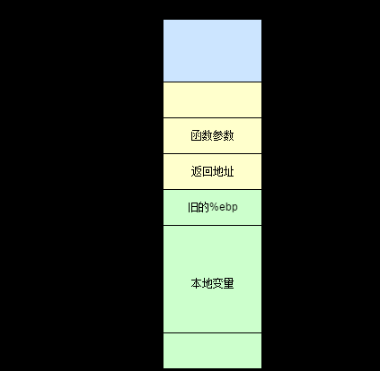
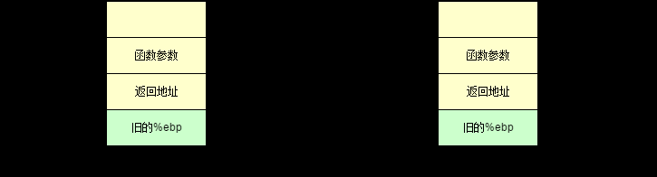
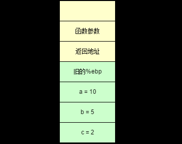
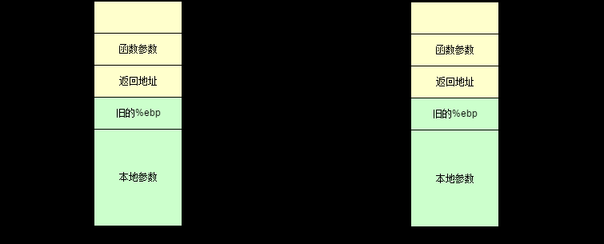

# C函数调用过程原理及函数栈帧分析

在 x86 的计算机系统中，内存空间中的栈主要用于保存函数的参数，返回值，返回地址，本地变量等。一切的函数调用都要将不同的数据、地址压入或者弹出栈。因此，为了更好地理解函数的调用，我们需要先来看看栈是怎么工作的。

## 栈是什么？

简单来说，栈是一种 LIFO 形式的数据结构，所有的数据都是后进先出。这种形式的数据结构正好满足我们调用函数的方式：父函数调用子函数，父函数在前，子函数在后；返回时，子函数先返回，父函数后返回。栈支持两种基本操作，push 和 pop。push 将数据压入栈中，pop 将栈中的数据弹出并存储到指定寄存器或者内存中。

这里是一个 push 操作的例子。假设我们有一个栈，其中黄色部分是已经写入数据的区域，绿色部分是还未写入数据的区域。现在我们将 0x50 压入栈中：

```null
// 将0x50的压入栈
push $0x50
```



图一：压栈操作

我们再来看看 pop 操作的例子：

```null
pop
```



图二：出栈操作

这里有两点需要注意的，第一，上面例子中栈的生长方向是从高地址到低地址的，这是因为在下文讲的栈帧中，栈就是向下生长的，因此这里也用这种形式的栈；第二，pop 操作后，栈中的数据并没有被清空，只是该数据我们无法直接访问。有了这些栈的基本知识，我们现在可以来看看在 x86-32bit 系统下，C 语言函数是如何调用的了。

## 栈帧是什么？

栈帧，也就是 stack frame，其本质就是一种栈，只是这种栈专门用于保存函数调用过程中的各种信息（参数，返回地址，本地变量等）。栈帧有栈顶和栈底之分，其中栈顶的地址最低，栈底的地址最高，SP(栈指针) 就是一直指向栈顶的。在 x86-32bit 中，我们用 `%ebp` 指向栈底，也就是基址指针；用 `%esp` 指向栈顶，也就是栈指针。下面是一个栈帧的示意图：



图三：栈帧示意图

一般来说，我们将 `%ebp` 到 `%esp` 之间区域当做栈帧（也有人认为该从函数参数开始，不过这不影响分析）。并不是整个栈空间只有一个栈帧，每调用一个函数，就会生成一个新的栈帧。在函数调用过程中，我们将调用函数的函数称为 “调用者(caller)”，将被调用的函数称为“被调用者(callee)”。在这个过程中，1）“调用者” 需要知道在哪里获取 “被调用者” 返回的值；2）“被调用者”需要知道传入的参数在哪里，3）返回的地址在哪里。同时，我们需要保证在 “被调用者” 返回后，`%ebp`, `%esp` 等寄存器的值应该和调用前一致。因此，我们需要使用栈来保存这些数据。

## 函数调用实例

### 函数的调用

我们直接通过实例来看函数是如何调用的。这是一个有参数但没有调用任何函数的简单函数，我们假设它被其他函数调用。

```null
int MyFunction(int x, int y, int z)
{
    int a, b, c;
    a = 10;
    b = 5;
    c = 2;
    ...
}

int TestFunction()
{
    int x = 1, y = 2, z = 3;
    MyFunction1(1, 2, 3);
    ...
}
```

对于这个函数，当调用时，`MyFunction()` 的汇编代码大致如下：

```null
_MyFunction:
    push %ebp            ; //保存%ebp的值
    movl %esp, $ebp      ; //将%esp的值赋给%ebp，使新的%ebp指向栈顶
    movl -12(%esp), %esp ; //分配额外空间给本地变量
    movl $10, -4(%ebp)   ; 
    movl $5,  -8(%ebp)   ; 
    movl $2,  -12(%ebp)  ; 
```

光看代码可能还是不太明白，我们先来看看此时的栈是什么样的：



图四：被调用者栈帧的生成

此时调用者做了两件事情：第一，将被调用函数的参数按照从右到左的顺序压入栈中。第二，将返回地址压入栈中。这两件事都是调用者负责的，因此压入的栈应该属于调用者的栈帧。我们再来看看被调用者，它也做了两件事情：第一，将老的（调用者的） `%ebp` 压入栈，此时 `%esp` 指向它。第二，将 `%esp` 的值赋给 `%ebp`, `%ebp` 就有了新的值，它也指向存放老 `%ebp` 的栈空间。这时，它成了是函数 `MyFunction()` 栈帧的栈底。这样，我们就保存了 “调用者” 函数的 `%ebp`，并且建立了一个新的栈帧。

只要这步弄明白了，下面的操作就好理解了。在 `%ebp` 更新后，我们先分配一块 0x12 字节的空间用于存放本地变量，这步一般都是用 `sub` 或者 `mov` 指令实现。在这里使用的是 `movl`。通过使用 `mov` 配合 `-4(%ebp)`, `-8(%ebp)` 和 `-12(%ebp)` 我们便可以给 `a`, `b` 和 `c` 赋值了。



图五：本地变量赋值后的栈帧

### 函数的返回

上面讲的都是函数的调用过程，我们现在来看看函数是如何返回的。从下面这个例子我们可以看出，和调用函数时正好相反。当函数完成自己的任务后，它会将 `%esp` 移到 `%ebp` 处，然后再弹出旧的 `%ebp` 的值到 `%ebp`。这样，`%ebp` 就恢复到了函数调用前的状态了。

```null
int MyFunction( int x, int y, int z )
{
    int a, int b, int c;
    ...
    return;
}
```

其汇编大致如下：

```null
_MyFunction:
    push %ebp
    movl %esp, %ebp
    movl -12(%esp), %esp
    ...
    mov %ebp, %esp
    pop %ebp
    ret
```

我们注意到最后有一个 `ret` 指令，这个指令相当于 `pop + jum`。它首先将数据（返回地址）弹出栈并保存到 `%eip` 中，然后处理器根据这个地址无条件地跳到相应位置获取新的指令。



图六：被调用者返回后的栈帧

## 总结

到这里，C 函数的调用过程就基本讲完了。函数的调用其实不难，只要搞懂了如何保存以及还原 `%ebp` 和 `%esp`，就能明白函数是如何通过栈帧进行调用和返回的了。希望这篇文章对你有帮助！

## 引用

在我学习栈帧以及写这篇文章的过程中，参考了下面这些文章，在这我感谢他们对我提供的大力的帮助。如果你对这些文章感兴趣，请访问以下链接：  
[1. x86 Instruction Set Reference](https://link.jianshu.com/?t=http://www.felixcloutier.com/x86/)   
[2. x86 Disassembly/Functions and Stack Frames](https://link.jianshu.com/?t=https://en.wikibooks.org/wiki/X86_Disassembly/Functions_and_Stack_Frames)   
[3. x86 Assembly Guide](https://link.jianshu.com/?t=http://www.cs.virginia.edu/~evans/cs216/guides/x86.html) 
 [https://www.cnblogs.com/sddai/p/9762968.html](https://www.cnblogs.com/sddai/p/9762968.html)
