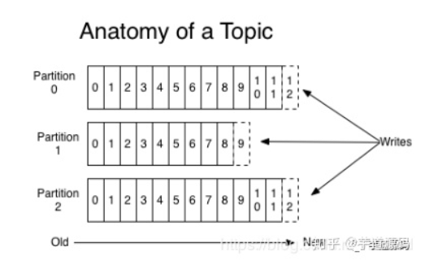
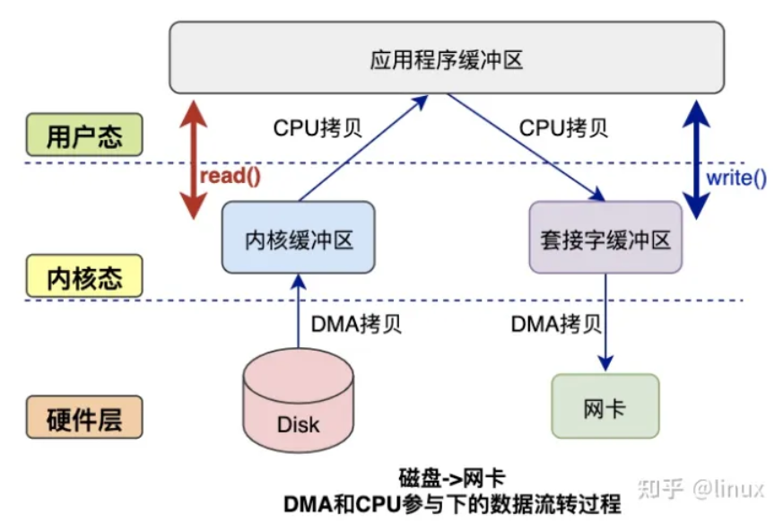
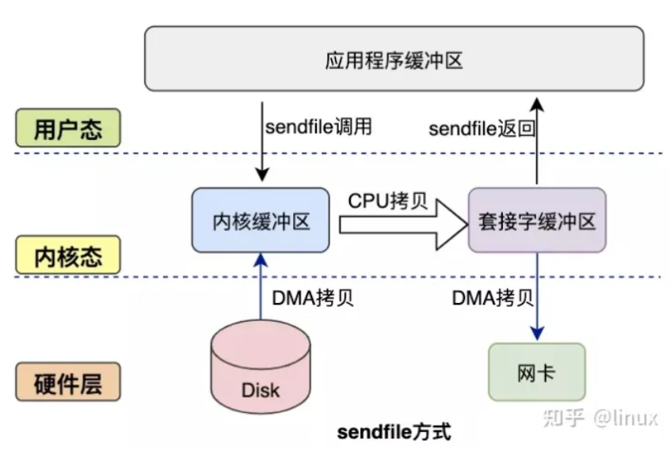

# 速度

## 写入数据

Kafka会把收到的消息都写入到硬盘中，它绝对不会丢失数据。为了优化写入速度Kafka采用了两个技术， 顺序写入和MMFile 。

### 顺序写入

每一个Partition其实都是一个文件 ，收到消息后Kafka会把数据插入到文件末尾（虚框部分）：

### Memory Mapped Files

Memory Mapped Files(后面简称mmap)也被翻译成 内存映射文件 ，在64位操作系统中一般可以表示20G的数据文件，它的工作原理是直接利用操作系统的Page来实现文件到物理内存的直接映射。

使用这种方式可以获取很大的I/O提升，省去了用户空间到内核空间复制的开销（调用文件的read会把数据先放到内核空间的内存中，然后再复制到用户空间的内存中。）

但也有一个很明显的缺陷——不可靠，写到mmap中的数据并没有被真正的写到硬盘，操作系统会在程序主动调用flush的时候才把数据真正的写到硬盘。

Kafka提供了一个参数——producer.type来控制是不是主动flush，如果Kafka写入到mmap之后就立即flush然后再返回Producer叫 同步 (sync)；写入mmap之后立即返回Producer不调用flush叫异步 (async)。

## 读取数据

### 基于sendfile实现Zero Copy

**传统数据发送**

**零拷贝发送**

### 批量压缩

Kafka允许使用递归的消息集合，批量的消息可以通过压缩的形式传输并且在日志中也可以保持压缩格式，直到被消费者解压缩