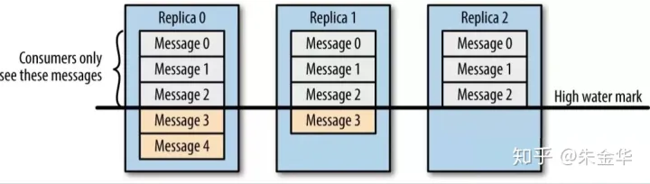

# kafka可靠性与一致性

## kafka的可靠性

0.8.0版本增加了对分区副本的支持，每个分区可以配置为几个副本，可以创建topic时指定。
在分区的副本中有一个是Leader，其余是follower，数据的读写操作都经过Leader进行，同时follwer会定期地去Leader同步数据。当Leader挂了之后，其中一个follwer会选举成为新的Leader。kafka通过分区副本引入数据冗余提供了数据可靠性， 支持副本数n-1的分区机器崩溃而不丢数据。

## kafka的一致性
kafka的一致性指分区的leader发生切换前后，读取的消息是一致的。这个通过HighWatermark实现，高水位取分区的ISR副本中最小的LEO，消费者只能读取到HW的上一条记录，这里LEO表示LogEndOffset，指该副本中当前日志的下一条。如图所示，只能读到消息Message2。
