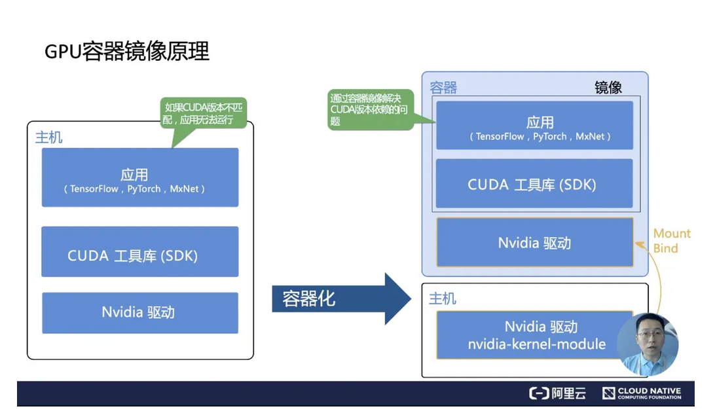
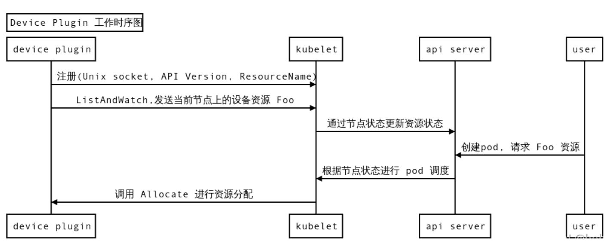

# device-plugin

## GPU 容器镜像原理

如下图左边所示，最底层是先安装 Nvidia 硬件驱动；再到上面是通用的 Cuda 工具库；最上层是 PyTorch、TensorFlow 这类的机器学习框架。

上两层的 CUDA 工具库和应用的耦合度较高，应用版本变动后，对应的 CUDA 版本大概率也要更新；而最下层的 Nvidia 驱动，通常情况下是比较稳定的，它不会像 CUDA 和应用一样，经常更新。

同时 Nvidia 驱动需要内核源码编译，如上图右侧所示，英伟达的 GPU 容器方案是：在宿主机上安装 Nvidia 驱动，而在 CUDA 以上的软件交给容器镜像来做。同时把 Nvidia 驱动里面的链接以 Mount Bind 的方式映射到容器中。

这样的一个好处是：当你安装了一个新的 Nvidia 驱动之后，你就可以在同一个机器节点上运行不同版本的 CUDA 镜像了。

## device-plugin原理

device-plugin其实就是一个grpc服务，他主要做如下几件事：

1. 向kubelet注册资源和设备
2. 当设备发生变化时，向kubelet更新
3. 接受kubelet申请第三方资源，并以参数的形式返回给kubelet

## Device Plugin 机制的缺陷

需要指出的是 Device Plugin 整个工作机制和流程上，实际上跟学术界和工业界的真实场景有比较大的差异。这里最大的问题在于 GPU 资源的调度工作，实际上都是在 kubelet 上完成的。

而作为全局的调度器对这个参与是非常有限的，作为传统的 Kubernetes 调度器来说，它只能处理 GPU 数量。一旦你的设备是异构的，不能简单地使用数目去描述需求的时候，比如我的 Pod 想运行在两个有 nvlink 的 GPU 上，这个 Device Plugin 就完全不能处理。

更不用说在许多场景上，我们希望调度器进行调度的时候，是根据整个集群的设备进行全局调度，这种场景是目前的 Device Plugin 无法满足的。

更为棘手的是在 Device Plugin 的设计和实现中，像 Allocate 和 ListAndWatch 的 API 去增加可扩展的参数也是没有作用的。这就是当我们使用一些比较复杂的设备使用需求的时候，实际上是无法通过 Device Plugin 来扩展 API 实现的。

因此目前的 Device Plugin 设计涵盖的场景其实是非常单一的， 是一个可用但是不好用的状态。这就能解释为什么像 Nvidia 这些厂商都实现了一个基于 Kubernetes 上游代码进行 fork 了自己解决方案，也是不得已而为之。