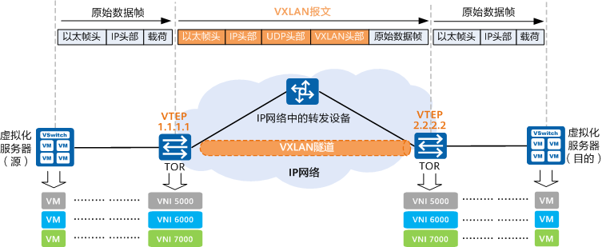
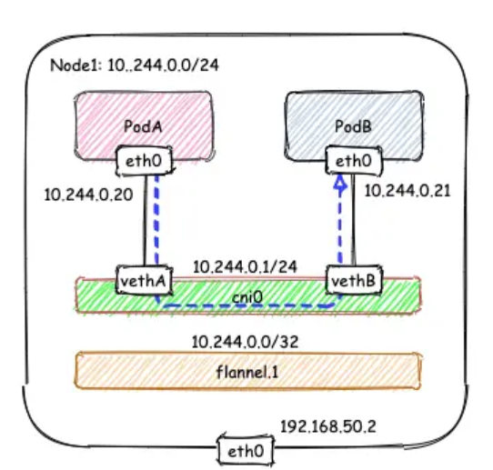
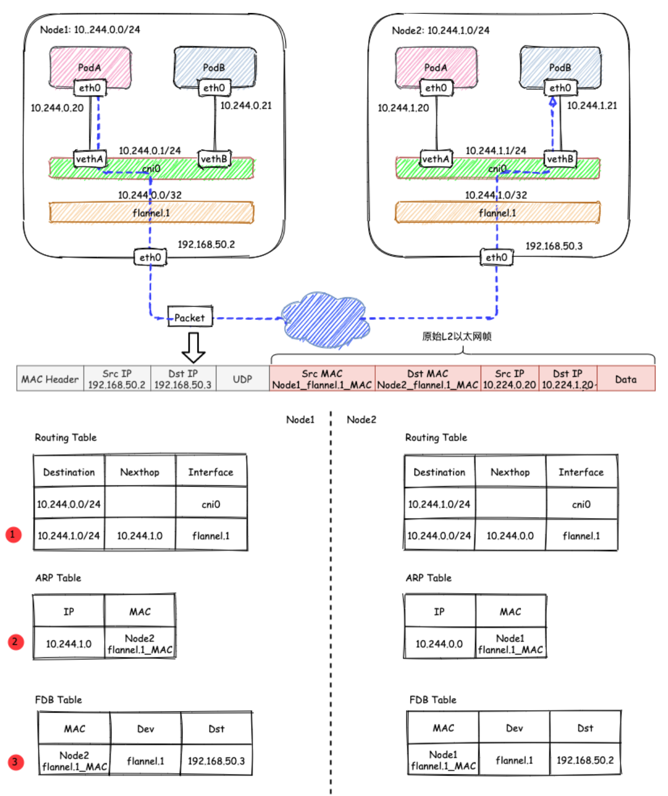
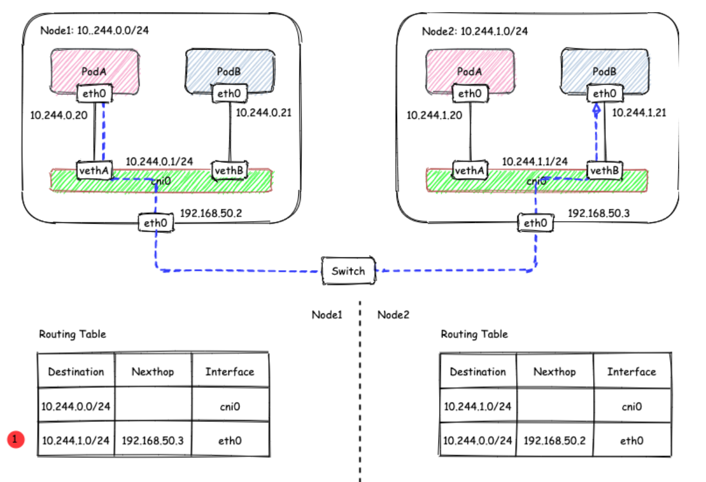
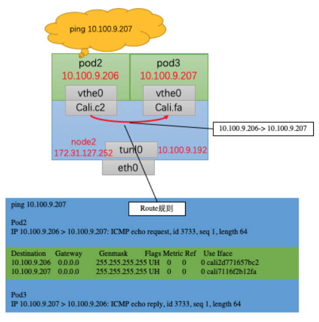
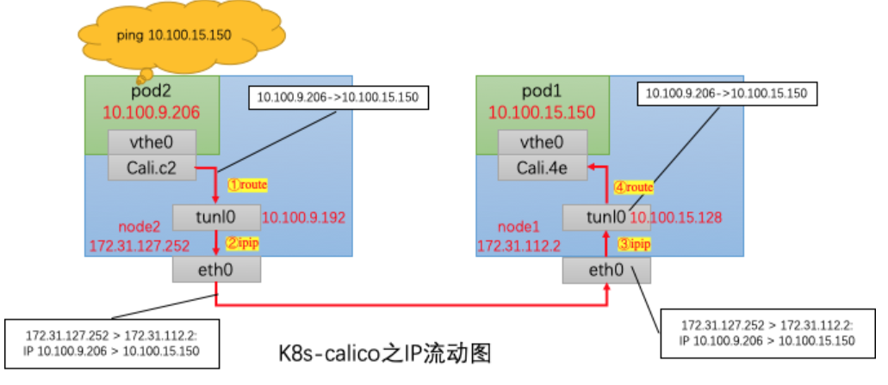
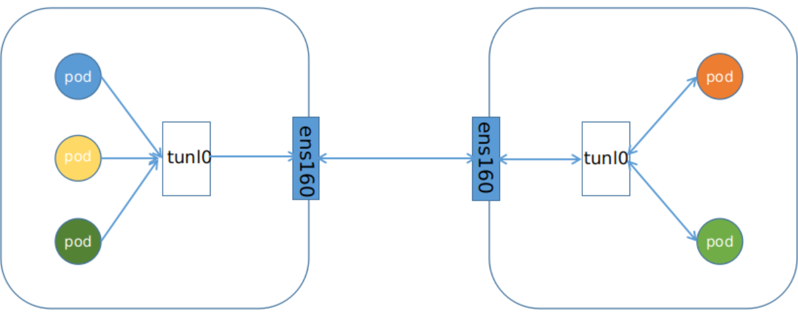

# 网络模式

## flannel

VXLAN的特点是将L2的以太帧封装到UDP报文（即L2 over L4）中，并在L3网络中传输。

### flannel vxlan 模式

#### 节点内通信

节点内的容器间通信通过 cni0 网桥就能完成，不涉及任何VXLAN报文的封包解包

#### 节点间通信

假设有两个节点Node1和Node2，其中Node1的PodA要跟Node2的PodB通信，则它们之间的通信过程如下图所示：

**发送端**：在PodA中发起 ping 10.244.1.21 ，ICMP 报文经过 cni0 网桥后交由 flannel.1 设备处理。 flannel.1 设备是一个VXLAN类型的设备，负责VXLAN封包解包。 因此，在发送端，flannel.1 将原始L2报文封装成VXLAN UDP报文，然后从 eth0 发送。
**接收端**：Node2收到UDP报文，发现是一个VXLAN类型报文，交由 flannel.1 进行解包。根据解包后得到的原始报文中的目的IP，将原始报文经由 cni0 网桥发送给PodB。

### flannel host-gw 模式

在host-gw模式下，由于不涉及VXLAN的封包解包，不再需要flannel.1虚机网卡。 flanneld 负责为各节点设置路由 ，将对应节点Pod子网的下一跳地址指向对应的节点的IP

## calico

### IPIP

#### 节点内通信

Calico会为每一个node分配一小段网络，同时会Wie每个pod创建一个“入”的ip route规则。如下图所示，当从pod2访问pod3时，Cali.c2是直接发出10.100.9.206-> 10.100.9.207流量的，在node2的ip route中，发往10.100.9.207的ip报直接会被转发到cali.fa，不会用到tunl0，只有在node间访问的时候才会使用tunl0进行ipip封装

#### 节点间通信

IPIP模式就是将一个IP数据包套在另一个IP包里，使用到了Linux提供的隧道技术。可以理解为一个基于IP层的网桥，将两个本不通的网络通过点对点连接起来

