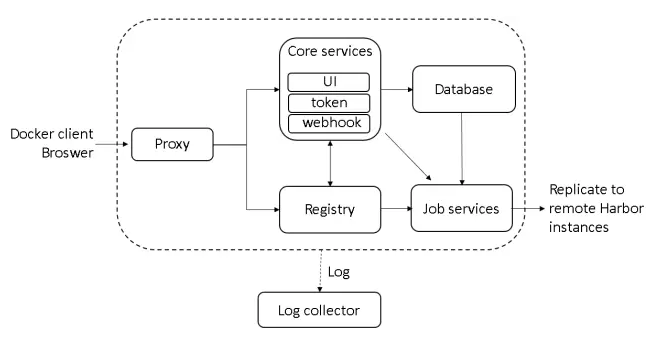
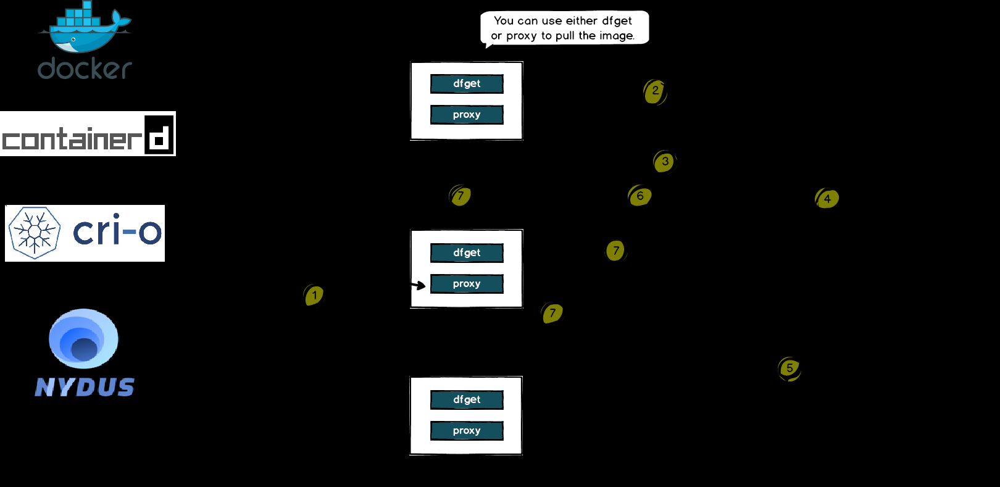

# 镜像管理

## Harbor

1. Proxy: Harbor的registry、UI、token services等组件，都处在一个反向代理后边。该代理将来自浏览器、docker clients的请求转发到后端服务上。
2. Registry: 负责存储Docker镜像，以及处理Docker push/pull请求。因为Harbor强制要求对镜像的访问做权限控制， 在每一次push/pull请求时，Registry会强制要求客户端从token service那里获得一个有效的token。
3. Core services: Harbor的核心功能，主要包括如下3个服务:
   1. UI: 作为Registry Webhook, 以图像用户界面的方式辅助用户管理镜像。1) WebHook是在registry中配置的一种机制， 当registry中镜像发生改变时，就可以通知到Harbor的webhook endpoint。Harbor使用webhook来更新日志、初始化同步job等。 2) Token service会根据该用户在一个工程中的角色，为每一次的push/pull请求分配对应的token。假如相应的请求并没有包含token的话，registry会将该请求重定向到token service。 3) Database 用于存放工程元数据、用户数据、角色数据、同步策略以及镜像元数据。
   2. Job services: 主要用于镜像复制，本地镜像可以被同步到远程Harbor实例上。
   3. Log collector: 负责收集其他模块的日志到一个地方

## Dragonfly

Dragonfly 架构主要分为三部分 Manager、Scheduler、Seed Peer 以及 Peer 各司其职组成 P2P 下载网络, Dfdaemon 可以作为 Seed Peer 和 Peer。 详细内容可以参考架构文档, 下面是各模块功能:

1. Manager: 维护各 P2P 集群的关联关系、动态配置管理、用户态以及权限管理等功能。也包含了前端控制台，方便用户进行可视化操作集群
2. Scheduler: 为下载节点选择最优下载父节点。异常情况控制 Dfdaemon 回源。
3. Seed Peer: Dfdaemon 开启 Seed Peer 模式可以作为 P2P 集群中回源下载节点, 也就是整个集群中下载的根节点。
4. Peer: 通过 Dfdaemon 部署，基于 C/S 架构提供 dfget 命令行下载工具，以及 dfget daemon 运行守护进程，提供任务下载能力。