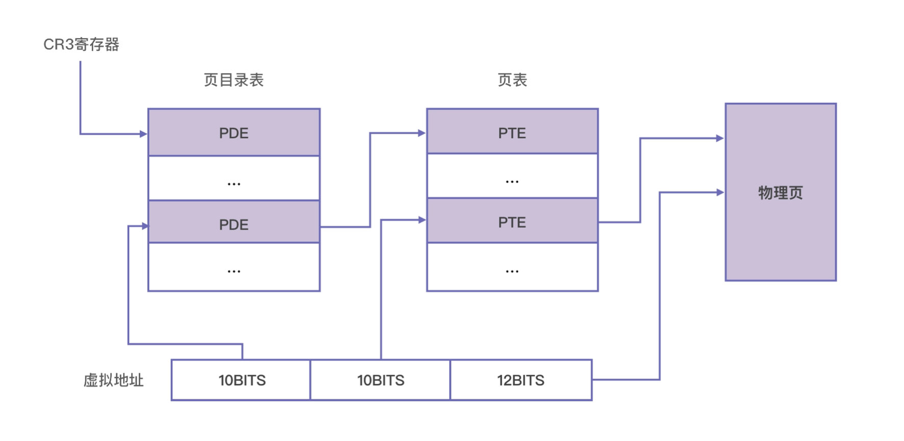

# CPU 如何根据虚拟内存地址找到真实的内存地址

1. 确定页目录基址
每一个CPU都有一个页目录基址寄存器，最高级页表的基地址就存在这个寄存器里。在X86上，这个寄存器是CR3.每一次计算物理地址时，MMU都会从CR3寄存器中取出页目录所在的物理地址。

2. 定位页目录项（PDE）
一个32位的虚拟地址可以拆成10位，10位和12位3段，上一步找到的页目录表基址加上高10位的值乘以4，就是页目录项的位置。这是因为，一个页目录项正好是4字节，所以1024个页目录项共占据4096个字节，即是4M，刚好组成1页，而1024个页目录项需要10位进行编码。这样，我们就可以通过最高10位找到改地址对应的PDE了。

3. 定位页表项（PTE)
页目录项里面记录着页表的位置，CPU通过页目录项找到页表的位置后，再用中间10位计算页表中的偏移，可以找到该虚拟地址所对应的页表项了。页表项也是4字节的，所以一页之内刚好也是1024项，用10位进行编码。所以计算公式与上一步相似，用页表基址加上中间10位乘以4，可以得到页表项的地址。

4. 确定真实的物理地址
上一步CPU已经找到页表项了，这里存储这物理地址，这才真正找到该虚拟地址所对应的物理页。虚拟地址的低12位，刚好可以对一页内的所有字节进行编码，所以我们用低12位来表示页内偏移，计算的公式是物理页的地址直接加上低12位。

