## 内存管理基础

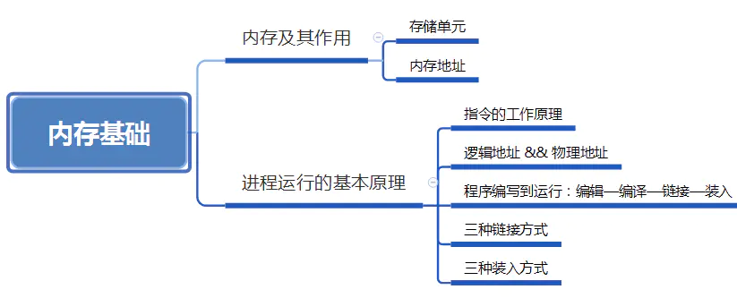

## 1 内存及其作用

  内存：**是被划分成一个个小的存储单元用于存放数据的硬件。程序执行前需要先放到内存中才能被CPU处理。**  
  系统中多程序是并发执行，运行的多个程序的数据都在内存中，那么如何区分各个程序的数据放在什么地方——给**内存单元编地址**。内存地址从0开始，每个地址对应一个存储单元。  
  编址方式：

> (1) **“按字节编址”**：即每个存储单元的大小为1字节，即1B，8个二进制位。  
> (2) **“按字编址”**：如果字长为16位的计算机，则每个存储单元大小为1个字，每个字的大小为16个二进制位。

## 2 逻辑地址和物理地址

  **逻辑地址**：编写的源文件经编译后，每个目标模块都从0号单元开始编址，这称为该目标模块的相对地址（或逻辑地址）。  
  **物理地址**空间是指内存中物理单元的集合，它是地址转换的最终地址，进程在运行时执行指令和访问数据，最后都要通过物理地址从主存中存取。  
  当装入程序将可执行代码装入内存时，必须通过地址转换将逻辑地址转换成物理地址，这个过程称为**地址重定位。**

## 3 指令运行原理

  下图表示x = x + 1 执行过程，x = x + 1经过编译变成3条机器指令。  
  指令1执行过程：

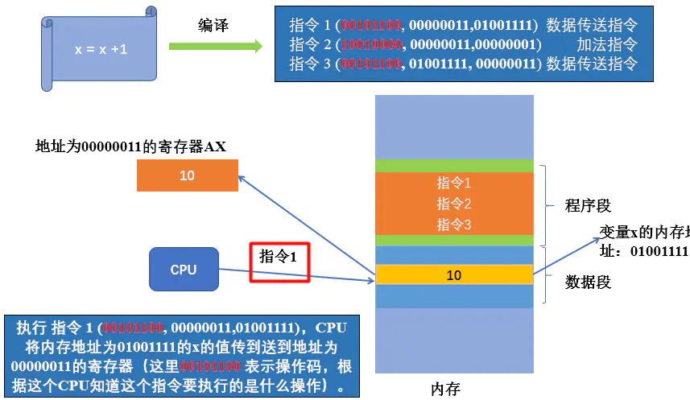

  指令2执行过程：

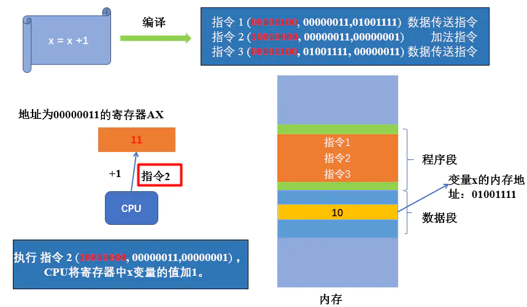

  
  指令3执行过程：  

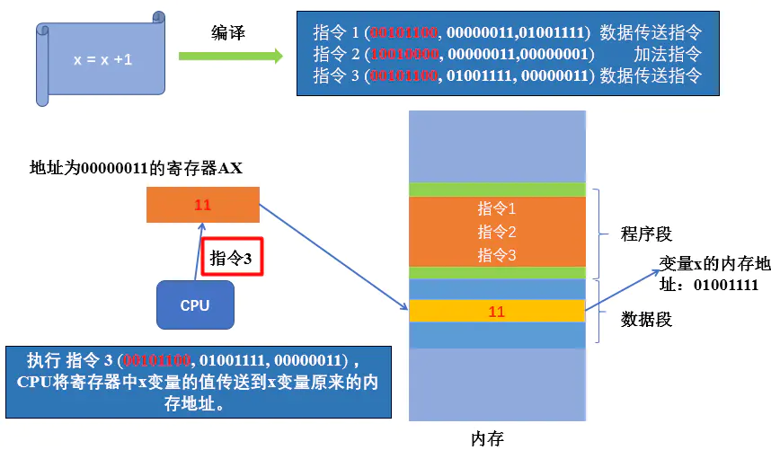

  指令的工作原理：每条指令都有一个**操作码**，CPU会根据这个操作码知道这条指令需要执行什么操作（如加法操作或传送操作），其次指令会带有**若干参数**，这些参数是这条指令可能需要的数据。CPU根据操作码和参数来对执行一条条由高级语言编译成的机器指令。

## 4 程序编写到运行过程

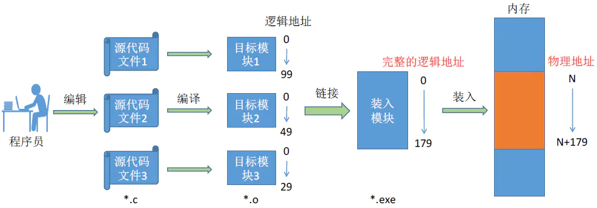

  **编译**：由编译程序将用户源代码编译成若干个目标模块（**编译就是将高级语言翻译为机器语言**）。  
  **链接**：由链接程序将编译后形成的一组目标模块，以及所需的库函数链接一起，形成一个完整的装入模块。  
  **装入**：由装入程序将装入模块装入内存运行。

## 5 装入的方式

  装入有三种方式：**绝对装入、静态重定位、动态重定位。**

####   5.1 绝对装入

  **绝对装入**：在编译时，如果知道程序将放到内存中哪个位置，编译程序将产生绝对地址的目标代码。装入程序按照装入模块中的地址，将程序和数据装入内存。  
  缺点：只适用单道程序环境。

####   5.2 静态重定位

  **静态重定位**：又称**可重定位装入**。编译、链接后的装入模块的地址都是从0开始的，指令中使用的地址、数据存放的地址都是相对于起始地址而言的逻辑地址。可根据内存的当前情况，将装入模块装入到内存的适当位置。装入时对地址进程“重定位”，将逻辑地址变换为物理地址（地址变换是在装入时一次完成的）。  
  特点：在一个作业装入内存时，必须分配其要求的**全部内存空间**，如果没有足够的内存空间，就不能装入该作业。作业一旦进入内存后，在运行期间就不能再移动，也**不能再申请内存空间**。  

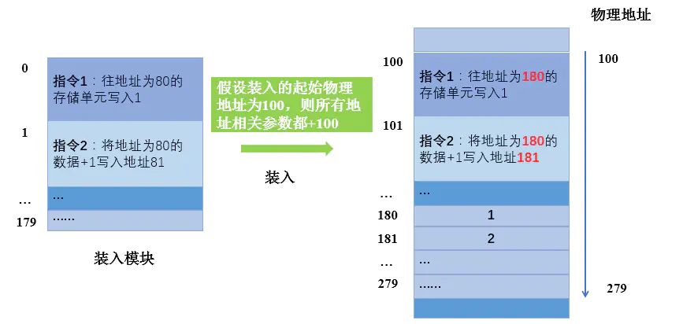

####   5.3 动态重定位

  **动态重定位**：又称**动态运行时装入**。编译、链接后的装入模块的地址都是从0开始。装入程序把装入模块装入内存后，并不会立即把逻辑地址转换为物理地址，而是把地址转换推迟真正要执行时才进行。因此装入内存后所有地址依然是逻辑地址。这种方式需要一个**重定位寄存器的支持。**  
  特点：逻辑地址转换为物理地址是执行时才进行。  

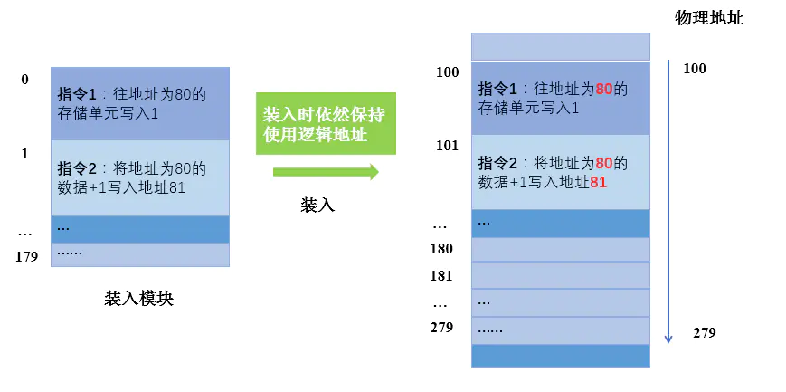

  借助重定位寄存器实现逻辑地址转换为物理地址

  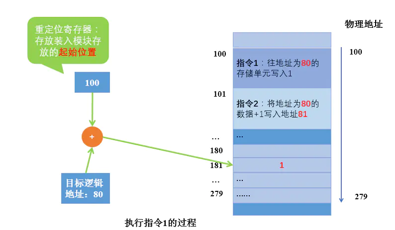

  动态重定位**允许程序在内存中发送移动**。可将程序分配到不连续的存储区中，在程序运行前只需装入它的部分运行即可投入运行，然后在程序运行期间，根据需要动态申请分配内存，便于程序段的共享，可以向用户提供一个比存储空间大得多的地址空间。

## 6 链接方式

  链接方式同样有三种：**静态链接、装入时动态链接、运行时动态链接**。

####    6.1 静态链接

  **静态链接**：在程序运行之前，先将各目标模块及它们所需的库函数连接成一个完整的可执行文件，之后不再拆开。  

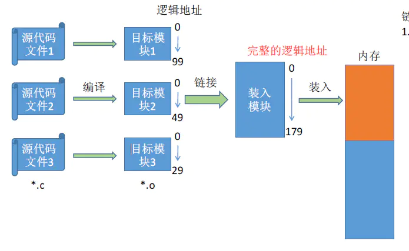

####    6.2 装入时动态链接

  **装入时动态链接**：将各目标模块装入内存时，边装入边链接的链接方式。  

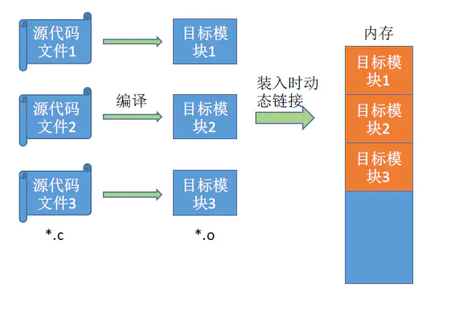

####    6.3

  **运行时动态链接**：在程序执行中需要该目标模块时，才对它进行链接。其优点是便于修改和更新，便于实现对目标模块的共享。  

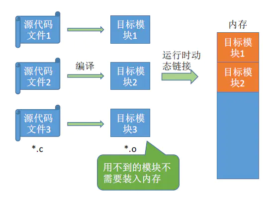

## 7 小结

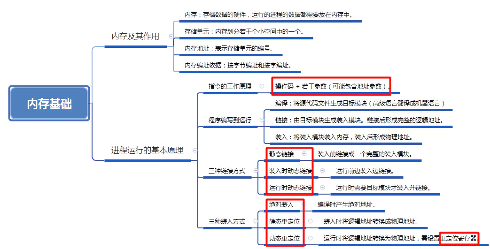