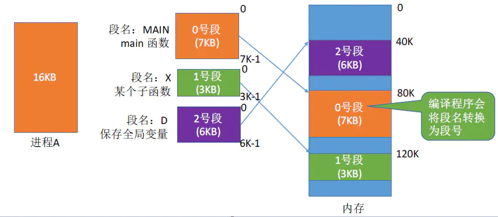
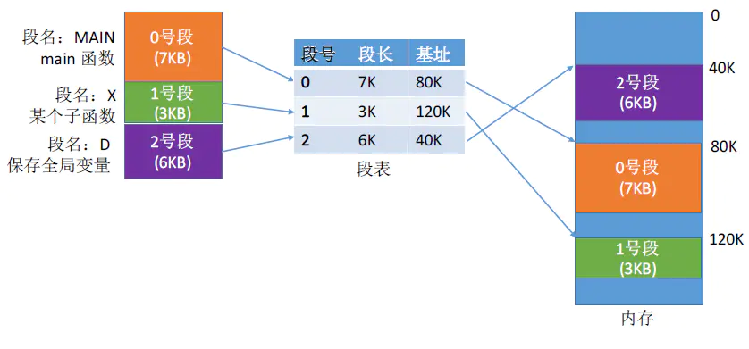
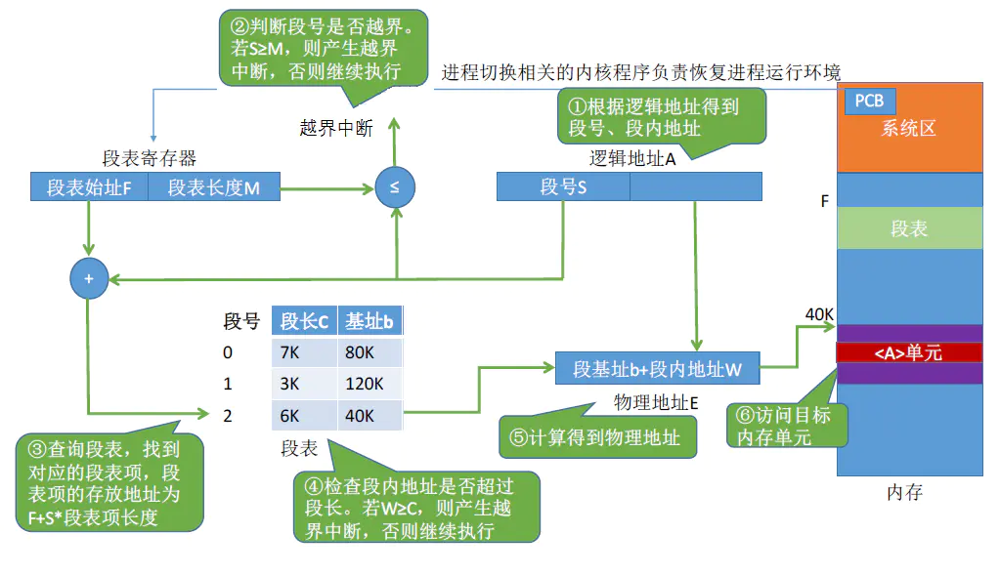
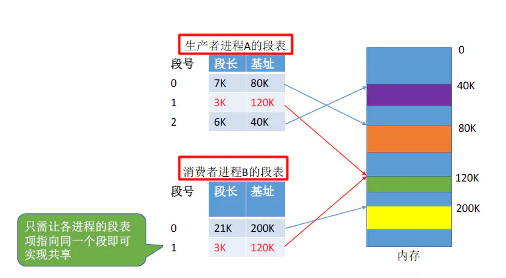
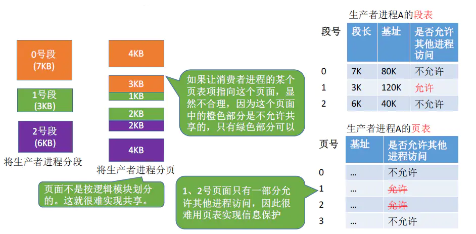

# 基本分段存储管理方式

## 前言

## 1 分段

  进程的地址空间：按照程序**自身的逻辑关系划分为若干个段**，每个段都有一个段名（在低级语言中，程序员使用段名来编程），**每段从0开始编址。**  
  内存分配规则：以段为单位进行分配，**每个段在内存中占据连续空间，但各段之间可以不相邻。**  
  举例说明，进程A大小为16KB，其中main函数占7KB，某个子函数占3KB，用于保存全局变量的占6KB，所以按照逻辑功能将进程A划分为3个段，每个段的逻辑地址都是从0开始的。程序运行时各个段在内存中占用连续的空间，但是各个段之间可以不相邻。  

  由于是按逻辑功能模块划分，用户**编程更方便，程序可读性更高。**

> 注：K表示数字大小，KB表示存储容量大小。1K = 1024,1KB = 1024B。

  分段系统的逻辑地址结构是由**段号**（段名）和**段内地址**（段内偏移量）所组成。  
  例如，若系统是按字节寻址，用32个二进制位表示逻辑地址，如果段号占和段内地址各占16位，那么它的逻辑地址结构图如下所示。  

  
  **段号的位数决定了每个进程最多可以分几个段。**  
  **段内地址位数决定了每个段的最大长度**。  
  在上述的例子中，段号占16位，所以每个进程最多有216 = 64K（64 \* 1024）个段，段内地址占16位，因此每个段的最大长度是216 = 64KB。

## 2 段表

  和分页存储一样，为了能保证程序能正常运行，就必须能从物理内存中找到各个逻辑段存放的位置。为此每个进程建立一张段映射表，简称“段表”。

> (1) 每个段对应一个段表项，其中记录了该段在内存中的**起始位置**（又称**“基址”**）和**段的长度**。页表中没有页长是因为所有的页的长度都是相等的。  
> (2) **各个段表项的长度是相同的。**

  例如上图，某关系系统中按字节寻址，采用分段存储管理，逻辑结构为（段号16位，段内地址16位），因此用16位即可表示最大段长。物理内存大小为4GB（可用32位表示整个物理内存的存储地址空间）。因此，可以让每个段表项占 16 + 32 = 48位，即6B。由于段表项长度是相同的，因此**段号可以是隐含的，不占存储空间。**若段表在内存中存放的起始地址为M，则K号段对应的段表项存放的地址M + 6 \* K。  
  下面介绍一下上面的几个参数：

> (1) 段内地址决定了段的最大段长，上例中最大段长是7K = 7 \* 210 < 8 \* 210 ，所以最少需要13个二进制位就可以表示改进程的最大段长，即最少需要2个字节（16个二进制位）。  
> (2) 内存4GB = 232 B ，按字编址，一个内存单元大小为1B，所以共有232 B/ 1B = 232个内存单元，所以内存的编号0~232 - 1，给基址分配的空间大小就需要可以表示0~232 - 1中的任何一个数，最大是232 - 1，所以需要32个二进制位，即4个字节。  
> (3) 所以，一个段表项的大小就是 2 + 4 = 6B（字节）。

## 3 地址的转换

  进程运行时，操作系统会将内存中PCB中段表的起始地址F和段表长度M传送到段表寄存器中。

> (1) 根据逻辑地址得到段号、段内地址。  
> (2) 判断段号是否越界。  
> (3) 查询段表，找到对应的段表项，段表项存放的地址为F + S \* 段表项长度。  
> (4) **检查段内地址是否超过段长。**这是分段和分页的区别，具体后面分析。  
> (5) 计算得到物理地址，物理地址 = 段基址 + 段内地址。  
> (6) 访问目标内存单元。

  在分页中为什么不需判断页内偏移量是否大于页长？而分段需要判断段内偏移量大于段长？

>   在分页系统中，页面大小（页长）是固定的L，如4KB = 4096，而页内偏移量W = 逻辑地址 % 页面大小L，所以页内偏移量W一定是小于L的，所以不需要判断页内偏移量大于页长。  
>   同理，根据逻辑地址也可以判断。如果每个页面的大小为2kB，用二进制表示逻辑地址，则末尾的K位表示页内偏移量，其余部分就是页号。例如，如果页面大小为2KB，则逻辑地址结构图如下，那么页内偏移量最大为212 - 1 < 2KB。  
> 
> 

> 对于分段存储管理的系统中，由于段长的**不固定**的，这就可能会有段内地址（段内偏移量）大于段长的情况，所以需要判断段内偏移量是否大于段长。拿第二节的图为例，用16位表示段内地址，即段内偏移量最大为64K，而三个段的段长都小于64K，所以需要进行判断。

## 4 分段、分页管理的对比

  (1) **页**是**信息是物理单位**。分页的主要目的是为了实现离散分配，提高内存利用率。分页仅仅是系统管理上需要，**完全是系统行为**，对用户不可见。  
  (2) **段**是**信息的逻辑单位。**分段的主要目的是更好的满足用户需求。一个段通常包含一组属于一个逻辑块的信息。分段对用户是可见的，用户编程时需要显示给出段名。  
  (3) 页的大小**固定且由系统决定**。段的长度**不固定**，决定于用户编写的程序。  
  **分页的用户进程地址空间是一维的。**在确定页的大小情况下，只需要给出逻辑地址就可以定位到相应的内存地址。**分段的用户进程地址空间是二维的。**要标识一个地址必须给出段名和段内地址。  
  (4) **分段比分页更容易实现信息的共享和保护。**  
  不能被修改的代码称为纯代码或可重入代码（不属于临界资源），这样的代码是可以被共享的。而可修改的代码一般是不用于共享的，如一个代码中有多个变量，各进程并发同时访问可能造成数据不一致。  
  例如，如下图，将生产者进程分为三段，其中1号段是允许被生产者和消费者共享访问的。  

  
  如果想要将1好号段给消费者共享，只需将消费者进程段表中加入与生产者进程相同的1号段的段表项即可。  

  下面在看分页存储系统中的信息共享  
  同样将生产者进程分段，假设页面大小为4KB，那么分页后的共享的一号段被分为两页，同时每页还有不可共享代码，都只有一部分功能共享代码，从而就很难实现信息保护。

  (5) 访问内存的次数

> (1) **分页（单机页表）**：第一次访问内存——查询内存中的页表，第二次访问内存——访问目标内存单元。总共**两次**访问内存。  
> (2) 分段：第一次访问内存——查内存中段表，第二次访问内存——访问目标内存单元。总共访问**两次**内存。  
>   与分页系统类似，分段系统也可以引入\*_快表机构_，将近期访问过的段表项放到快表中，这样可以少访问一次内存，加速地址变换速度。

## 5 小结

