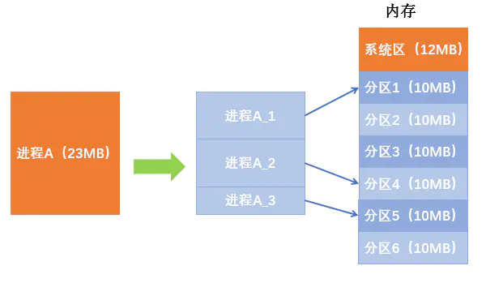

# 基本分页存储管理

## 前言

  
  连续分配：为用户进程分配的必须是一个**连续的内存空间。**  
  非连续分配：为用户进程分配的是一些**分散的内存空间。**

## 1 将连续分配改造成非连续分配版本

  假设进程A的大小为23MB，但是每个分区的大小只有10MB，如果进程只能占用一个分区，显然是放不下的。  
  解决思路：如果允许进程占用多个分区，那么可以把进程拆分成**10MB + 10MB + 3MB三个部分**，再把这三个部分别放在三个分区中（这些分区不要求连续）.....  

  
  进程A最后的一部分只有3MB，放入分区会产生一个7MB大小的内部碎片。  
  如果将每个分区的设为2MB，那么进程A就会拆成11 \* 2MB + 1MB共12个部分。最后一个部分1MB不会占满分区，会产生1MB碎片。  
  显然，**如果把分区设置的更小一点，内部碎片会更小，内存利用率会更高。**  
  基本分页存储管理的思想：**把内存划分为一个个相等的小分区，再按照分区的大小将进程拆分成一个个小部分**。

## 2 分页存储

  将内存空间分为一个个大小相等的分区（如每个分区4KB，每个分区就是一个**“页框”**，或称**“内存块”**、**“物理块”**。每个页框有一个编号，即**“页框号”**，或**“内存块号”**、**“物理块号”**，页框号**从0开始**）。将用户进程的地址空间也分为与页框大小相等的一个个区域，称为**页面**或**页**。页框的大小不能太大，否则可能会产生过大的内存碎片。  
  操作系统**以页框为单位为各个进程分配内存空间。**进程的每个页面分别放入一个页框中，即进程的**页面和内存的页框**有**一一对应**的关系。  

  
  各个页面不必连续存放，也不必按先后顺序，可以放在不相邻的各个页框中。

## 3 地址转换

  进程分页后，进程的各个页面可以放在不连续的页框中，所以如何实现逻辑地址到物理的地址的转换？  
  如下图，将下面的进程分页，假设每页大小为50B，那么就分为4个页面。  

  
  指令1需要访问逻辑地址为80的单元，逻辑地址为80的内存单元在**1号页**，如果1号页在内存中的物理地址为450，逻辑地址为80的内存单元相对于该页的起始地址而言，**偏移量为30**，所以**实际物理地址 = 450 + 30 = 480**。  
  所以要将逻辑地址转化为实际地址需要：

> (1) **要算出逻辑地址对应的页号。**  
> (2) **要知道该页号对应的页面在内存中的起始地址。**  
> (3) **计算出逻辑地址在页面内的偏移量。**  
> (4) **物理地址 = 页面起始地址 + 偏移量。**

  手动计算方法：  
  **页号** = 逻辑地址 / 页面长度（取整数部分）。  
  **页内偏移量**\= 逻辑地址 % 页面长度  
  **页面在内存中的起始位置**：操作系统需要用某种数据结构记录进程各个页面的起始位置。  
  对于计算机，通常将**页面的大小划分为2的整数次幂**。假设用32个二进制位表示逻辑地址，页面大小为取212B = 4096B = 4KB。  

  如逻辑地址2，用二进制表示00000000 00000000 0000**0000 00000010**，前24位二进制对应的十进制值就是逻辑地址2对应的页号，即0号页，而后12二进制位对应的十进制值就是偏移量。如果0号页在内存中的起始地址为X，那么逻辑地址2对应的物理地址就是 X + 2.  
  同理，逻辑地址4097，用二进制表示00000000 00000000 0001**0000 00000001**，前24位二进制对应的十进制值就是逻辑地址4097对应的页号，即1号页，而后12二进制位对应的十进制值就是偏移量。如果0号页在内存中的起始地址为Y，那么逻辑地址4097对应的物理地址就是 Y + 1.  
  结论：**如果每个页面的大小为2kB，用二进制表示逻辑地址，则末尾的K位表示页内偏移量，其余部分就是页号。**  
  因此，如果让**每个页面的大小为2的整数次幂，**计算机就可以很方便的得出一个逻辑地址对应的页号和页内偏移量。  
  如果一个页面的大小为2KB，那分页存储管理的逻辑地址结构为：  

  地址结构包括两个部分：前一个部分表示页号，后一个部分表示页内偏移量W。

## 4 页表

  在知道如何计算页号和偏移量后，要计算实际的物理地址，还需要知道页号在内存中的起始地址，如何知道每个页面在内存中存放的位置——操作系统要为**每个进程建立一张页表。**  

> (1) 一个进程对应一张页表。  
> (2) 进程的每一页对应一个页表项。  
> (3) 每个页表项由**页号**和**块号**组成。  
> (4) 页表记录**进程页面和实际存放的内存块之间的对应关系。**  
> (5) 每个页表项的长度都是相同的，页号是**隐含**的（下小节）。

  按照之前的方法计算出逻辑地址所对应的页号N，然后根据页表区查询实际的内存块号M，由于每个内存块号的大小都是相等的，所以实际地址 = M \* 内存块大小 + 偏移量。

## 5 页号隐含

  在实际上，页表中是没有页号的，那怎么找到实际对应的内存块号呢？  
  假设某系统物理内存大小为4GB，页面大小为4KB，则每个页表项至少应该占用多少字节？

> 4GB = 232B，4KB = 212B。  
>   因此4GB的内存一共被分为232/212 = 220个内存块，所以页表中块号的值是0~220\-1。那么如果用二进制要表示最大的块号220\-1需要20个二进制位，所以至少需要3个字节（24个二进制位）。

  各页表项会**按顺序连续地**存放在内存中，如果该页表在内存中存放的地址为X，则M号页对应的页表项存放的地址为：X + M \* 3B  
  因此，页表的页号可以是隐含的。只需要知道**页表存放的起始地址**和**页表项长度**，即可找到各个页号对应的页表项存放的位置，找到位置后就可以读取该位置的值，即实际内存块号。  
  举个例子，如果按照逻辑地址计算出了偏移量为20，页号为1，页表中的页号是隐藏的，那么根据页表在内存中的起始地址20（假设的值），以及页表项长度3B，那么页号为1所对应的实际内存块号的值所在的地址就是：20 + 3 \* 1 = 23的位置，然后在该位置的值，该值就是实际内存块号，如果是4的话，那么实际地址就是： 4 \* 页面大小（4096B） + 20 = 16404。

## 6 基本分页小结

## 7 基本地址变换结构

  基本地址变换结构可以借助进程的页表将逻辑地址转换为物理地址。  
  通常在系统中设置一个**页表寄存器（PTR Page-Table Register）**，存放**页表在内存中起始地址F**和**页表长度M**。  
  进程在未执行时，页表的起址和页表长度放在**进程控制块（PCB）中**，当进程被调度时，操作系统内核会把它们放在页表寄存器中。  

  逻辑地址到物理地址变换的过程：

> (1) 计算页号P和页内偏移量W。  
> (2) 比较页号P和页表长度M，如果P>= M，则会抛出越界异常。  
> (3) 页表中页号P对应的**页表项地址 = 页表始址 + 页号 \* 页表项长度**，取出该页表项内容b，即内存块号。  
> (4) 计算实际物理地址 = b \* L + W 。

  比较页表长度，页表项长度和页面大小三个概念：

>   (1) 页面大小指一个页面占多大的内存空间。  
>   (2) 页表长度是指页表最多能有多少个页表项。  
>   (3) 页表项长度指每个页表项所占用的内存大小。

  在分页存储管理（页式管理）系统中，只要确定了每个页面的大小，逻辑地址结构就确定了。因此，**页式管理中地址是一维的。**即只要给出一个逻辑地址，系统就可以自动算出页号、页内偏移量两个部分，并不需要显示告系统这个逻辑地址中，页内偏移量占多少位。  
  基本地址变换结构需要访问两次内存：**第一次访问内存查找页表；第二次访问物理内存对应的内存单元。**

## 8 具有快表的地址变换结构

####    8.1 局部性原理

  对于上图，会很频繁地访问10号块中的指令、23号块。  
  **时间局部性**：如果执行了程序中的某条指令，那么不久后这条指令很有可能再次执行：如果某个数据被访问过，不久之后该数据很有可能再次被访问。（因此程序中存在大量循环）。  
  **空间局限性**：一旦程序访问了某个存储单元，在不久之后，其附近的存储单元也很有可能被访问。（因为很多数据在内存中都是连续存放的。如上面的数组，每次循环一次都会访问邻近的下一个元素地址）。  
  在基本地址变换机构中，每次访问一个逻辑地址，都需要查询内幕才能中的页表。由于局部性原理，可能连续很多次查找到的都是一个页表项。既然如此，就可以利用这个特性减少访问页表的次数——快表。

####    8.2 快表

  **快表**，又称**联想寄存器（TLB）**，是一种**访问速度比内存快很多**的高速缓冲存储器，用来存储当前访问的若干页表项，以加速地址变换的过程。与此对应，内存中的页表常称为**慢表。**  
  快表的地址包换过程：  
  (1) CPU给出逻辑地址，由某个硬件算得页号、页内偏移量，将页号与快表中的所有页号进行比较。  
  (2) 如果找到匹配的页号，说明要访问的页表项在快表中有副本，则直接从中取出该页对应的内存块号，再根据内存块号中与页内偏移量算地物理地址。最后访问该物理地址对应的内存单元。因此如果快表命中，则访问某个逻辑地址只需**一次**访问内存即可。  
  (3) 如果没有找到匹配的页号，则就需要访问页表，需要两次访问内存，在第一次访问内存查询得到页号后，需要将页号添加到快表中，以便后面再次被访问。如果快表已满，则必须按照一定的算法对旧的页表项进行替换。  
  由于查询快表比查询页表的速度快很多，因此只要快表命中，就可以节省很多时间。因为局部性原理，一般来说快表的命中率可以达到90%以上。

> 例如，某系统使用基本分页存储管理，并采用具有快表的地址变换机构，访问一次快表耗时1us，访问内存耗时100us，若快表的命中率为90%，则访问一个逻辑地址的平均耗时是多少？  
> （1 + 100） \* 0.9 + （1 + 100 +100） \* 0.1 = 111us。  
> 若没有使用快表则访问耗时：100 + 100 = 200us。  
> 可见引入快表机制，访问速度可以提高近一倍。

## 9 小结

