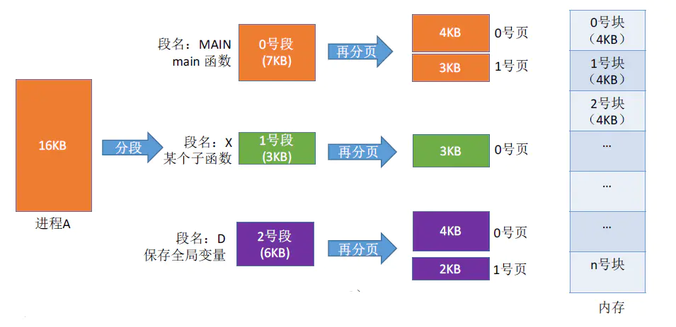
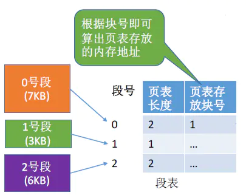
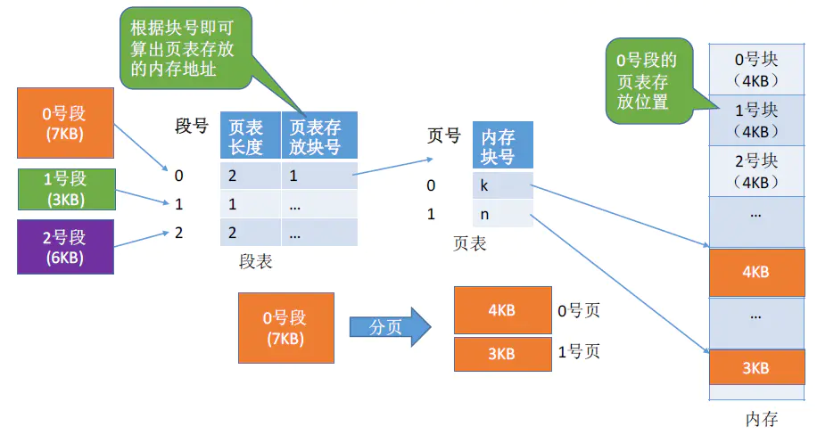
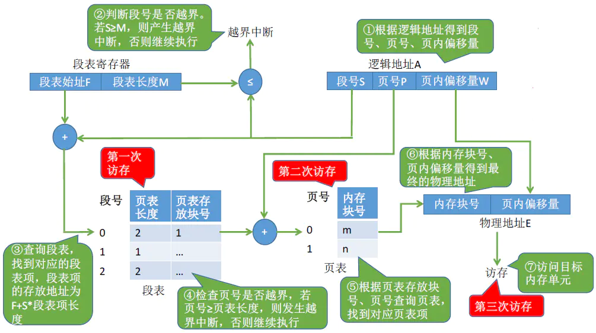

# 段页式内存管理

## 前言

## 1 分段、分页的优缺点分析

## 2 段页式管理

  考虑到分段方式和分页方式的优缺点，所以就有了一种新的分配方式——**段页式管理方式**。顾明思议，是综合了分段和分页两种管理方式。  
  还是举例说明，如下图所示，进程A大小为16KB，按逻辑分为3个段，各个段大小分别为7KB，3KB和6KB。然后再对各个段进行分页，假设页面大小为4KB，那么各个段都有各自对应的页面，即0号段分为两个页面0号页和1号页....这里各个段分页后页号都是从0开始。在运行时再将各个页放入内存块中，各个页之间同样不需要相邻。  

  
  所以，段页式管理方式基本思路为：**将进程按逻辑模块分段，每个段都有自己的段号，再将段分成若干大小固定的页。对内存空间的管理仍然和分页存储管理一样，将其分成若干个和页面大小相同的存储块，最后将进程的各个页分别装入各个内存块中。**  
  分段系统的逻辑地址结构由段号和段内地址（段内偏移量）组成。如：  

     段页式系统中由于每个段又进行了分页，所以段页式系统中的逻辑地址结构由段号、页号、页内地址（页内偏移量）组成。如：

> (1) **段号的位数决定了每个进程最多可以分为几个段。**  
> (2) **页号的位数决定了每个段最大有多少页。**  
> (3) **页内偏移量决定了页面的大小、内存块的大小是多少。**

  在上述例子中，若按字节寻址，32位的逻辑地址结构，段号占16位，段内偏移量占16位，因此在该系统中，每个进程最多有216 = 64K个段，页号占4位，因此每个段最多有16个页，页内偏移量占12位，因此每个页面的\\每个内存块的大小为 212 B = 4KB。

## 3 段表、页表

  (1) 每个段对应一个段表项，每个段表项由**段号、页表长度、页表存放的块号（页表的起始地址）**组成。每个**段表项长度相等，段号是隐含的。**  

  
  每个页面对应一个页表项，每个页表由页号、页面存放的内存块号组成。每个页表项长度相等，页号是隐含的。  
  例如要查找0号段对应的页表，0号段对应的页表存放在1号块，所以就可以得到0号段页表的起始地址，如果要查找0号段页表的页，根据页表也就可以找到相对应的内存块号，最后访问目标单元。 

从上图可以看出，这种方式同样有**内部碎片**。

## 4 地址变换

  段页式系统的地址转换过程如下图所示，过程是综合了分页和分段两种，如果前两种地址变换过程没有问题，这个变换同样也很简单。  
  段页式系统地址变换需要访问**三次**内存。**第一次是查询段表，第二次是根据段号查询页表，第三次是访问目标内存单元。**  
  最后，段页式系统同样可以引入快表机制来减少访问内存的次数，用段号和页号作为查询快表的关键字，若快表命中则仅需一次访存。  

## 5 小结

