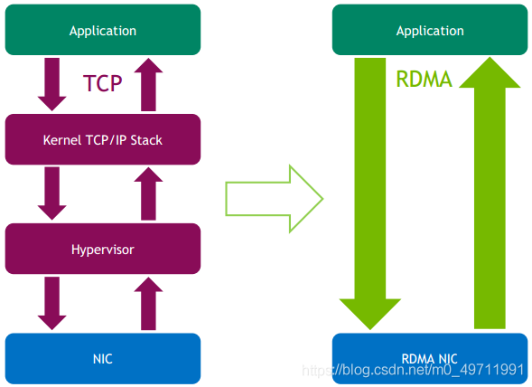
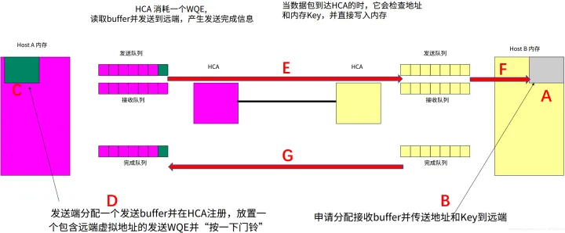

# RDMA

RDMA网络目前应用比较广泛的是InfiniBand 和RoCE (RDMA over Converged Ethernet)。

RDMA网络由于采用了**硬件网卡直接读取内存数据**，无需经过系统内核，因此可以极大降低网络延时、降低CPU开销、提高传输速率。

由于RDMA具有的明显优势，在人工智能、高性能计算、大数据分析等高I/O低延迟场景下具有广泛应用。我们来看看它的传输原理：

A、接收端先准备内存空间（buffer），用来存放将要接收的数据。

B、准备好之后，将空间的地址与生存的密钥Key发送到远端（即发送端）。

C、发送端收到信息后，开始准备要发送的数据，把数据放在内存里，然后把这块内存地址写到HCA卡（RDMA网卡）。

D、发送端HCA卡（RDMA网卡）会生成一个数据结构（WQE），里面包含各种地址、属性等信息。然后把这个WQE放置到发送队列，并按一下门铃（ring doorbell），代表发送任务下达，

E、发送端HCA卡（RDMA网卡）收到门铃后，主动把WQE里面的地址信息翻译，并启动DMA过程，从C的内存空间获取数据，封装成RDMA协议报文并发送出去。

F、接收端HCA卡（RDMA网卡）收到数据后，在网卡内部进行RDMA协议处理，剥离报头，进行数据完整性校验等。然后启动DMA过程，把数据直接写入A准备好的内存空间中。

## 参考

[**RDMA编程**](https://blog.csdn.net/weixin_43016254/article/details/89462607)

## RoCEv2

<!-- TODO -->