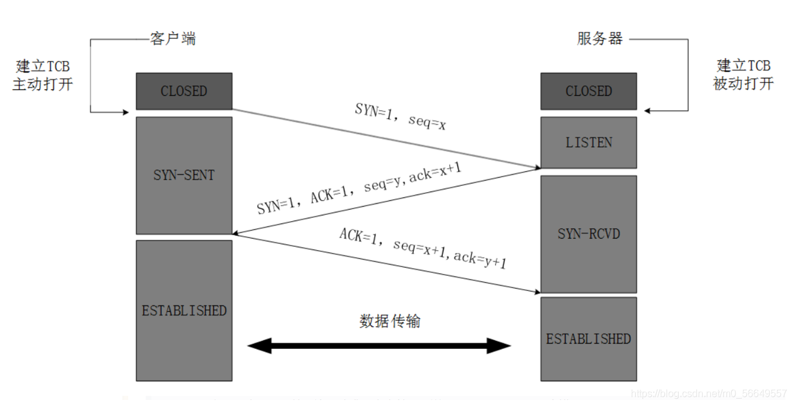
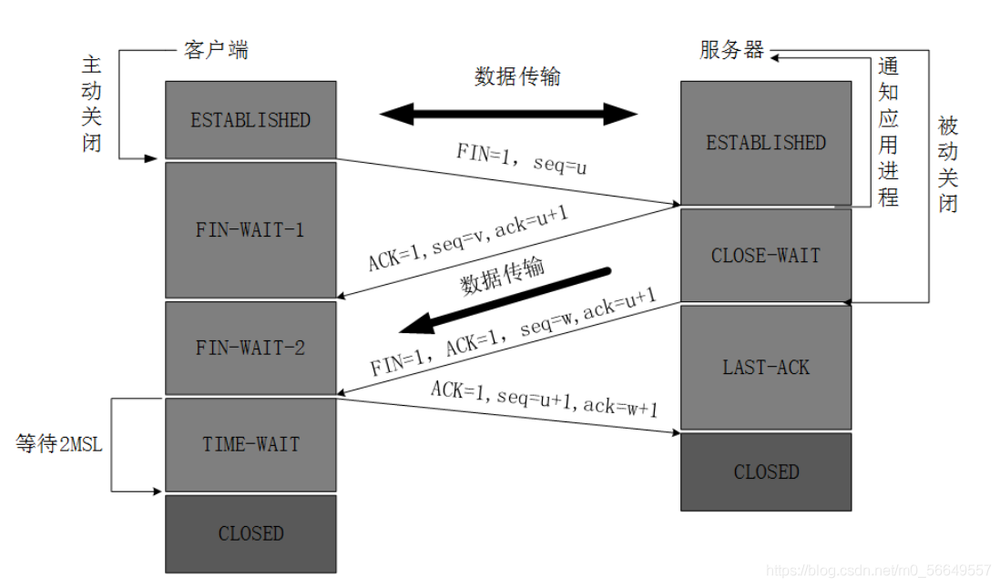

# TCP

## 三次握手四次挥手



### 为什么需要三次握手，两次不行吗
如果采用两次握手会出现以下情况：
客户端向服务器端发送的请求报文由于网络等原因滞留，未能发送到服务器端，此时连接请求报文失效，客户端会再次向服务器端发送请求报文，之后与服务器端建立连接，当连接释放后，由于网络通畅了，第一次客户端发送的请求报文又突然到达了服务器端，这条请求报文本该失效了，但此时服务器端误认为客户端又发送了一次连接请求，两次握手建立好连接，此时客户端忽略服务器端发来的确认，也不发送数据，造成不必要的错误和网络资源的浪费。



### TCP挥手为什么需要四次？
因为TCP是全双工通信的

## 2MSL等待状态
TIME_WAIT状态也称为2MSL等待状态，当TCP执行一个主动关闭，并发回最后一个ACK，该连接必须在TIME_WAIT状态停留的时间为2倍的MSL。这样可让TCP再次发送最后的ACK以防这个ACK丢失（另一端超时并重发最后的FIN）

## MTU

在应用程序中我们用到的Data的长度最大是多少，直接取决于底层的限制。 　　
我们从下到上分析一下： 　　
1. 在链路层，由以太网的物理特性决定了数据帧的长度为(46＋18)－(1500＋18)，其中的18是数据帧的头和尾，也就是说数据帧的内容最大为1500(不包括帧头和帧尾)，即MTU(Maximum Transmission Unit)为1500； 　
2. 在网络层，因为IP包的首部要占用20字节，所以这的MTU为1500－20＝1480；　
3. 在传输层，对于UDP包的首部要占用8字节，所以这的MTU为1480－8＝1472； 　　
4. 所以，在应用层，你的Data最大长度为1472。当我们的UDP包中的数据多于MTU(1472)时，发送方的IP层需要分片fragmentation进行传输，而在接收方IP层则需要进行数据报重组，由于UDP是不可靠的传输协议，如果分片丢失导致重组失败，将导致UDP数据包被丢弃。但在网络编程中，Internet中的路由器可能有设置成不同的值(小于默认值)，Internet上的标准MTU值为576，所以Internet的UDP编程时数据长度最好在576－20－8＝548字节以内。
5. UDP 包的大小就应该是 1500 - IP头(20) - UDP头(8) = 1472(Bytes)
6. TCP 包的大小就应该是 1500 - IP头(20) - TCP头(20) = 1460 (Bytes)


## TCP流量控制

### 实现方法
由滑动窗口协议（连续ARQ协议）实现。滑动窗口协议既保证了分组无差错、有序接收，也实现了流量控制。主要的方式就是接收方返回的 ACK 中会包含自己的接收窗口的大小，并且利用大小来控制发送方的数据发送。

### 避免死锁
当发送者收到了一个窗口为0的应答，发送者便停止发送，等待接收者的下一个应答。但是如果这个窗口不为0的应答在传输过程丢失，发送者一直等待下去，而接收者以为发送者已经收到该应答，等待接收新数据，这样双方就相互等待，从而产生死锁。

为了避免流量控制引发的死锁，TCP使用了持续计时器。每当发送者收到一个零窗口的应答后就启动该计时器。时间一到便主动发送报文询问接收者的窗口大小。若接收者仍然返回零窗口，则重置该计时器继续等待；若窗口不为0，则表示应答报文丢失了，此时重置发送窗口后开始发送，这样就避免了死锁的产生。

### 设置窗口大小
设置socket 缓冲区

## TCP拥塞控制

### 慢开始
1. 发送方维持拥塞窗口cwnd, 开始cwnd=1
2. 每当收到一个ACK，cwnd大小加一，呈线性上升
3. 每当过了一个往返延迟时间RTT(Round-Trip Time), cwnd=cwnd*2
4. cwnd > ssthresh(慢开始门限)进入`拥塞避免算法`

### 拥塞避免
1. 收到一个ACK, 则cwnd = cwnd + 1 / cwnd
2. 每当过了一个往返延迟时间RTT，cwnd=cwnd+1


### 快重传
1. 接收方每收到一个失序的报文段后就立即发出重复确认(比如缺失M2, 收到M3, M4, M5...)
2. 发送方只要一连收到三个重复确认就应当立即重传对方尚未收到的报文段

### 快恢复1
1. 发送方连续收到三个重复确认时，就执行"乘法减小"算法，把慢开始门限ssthresh减半
2. 发送方把 cwnd 值设置为慢开始门限 ssthresh 减半后的数值，然后开始执行拥塞避免算法

## TCP如何保证可靠性传输

```
1.校验和
发送的数据包的二进制相加然后取反，目的是检验数据在传输过程中是否有变化。如果收到段的校验和有差错，TCP将丢弃这个报文段和不确认接收到此报文段。
2.确认应答 + 序列号
TCP给发送的每一个数据包进行编号，接收方对数据包进行排序，把有序数据传递给应用层。
3.超时重传
当TCP发出一个段后，会启动一个计时器，等待目的端口确认接收到这个报文段。如果不能及时收到一个接收确认，将重传这个报文段。
4.流量控制
TCP连接的每一方都有固定大小的缓冲空间，TCP的接收端只允许发送端发送接收端缓冲区能够接纳的数据。当接收方来不及处理发送方的数据时，能够提示发送方降低发送的速率，防止包丢失。
TCP用的流量控制协议是可变大小的滑动窗口协议。接收方有即时窗口（滑动窗口rwnd），随ACK报文发送。
5.拥塞控制
当网络拥塞时，减少数据的发送。
发送方有拥塞窗口，随ACK报文发送。
```