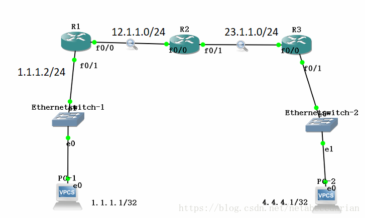

# 二三层网络转发原理

## 交换机

1. 交换机工作在数据链路层，也就是说交换机是一种二层设备，所有的交换机都组成一个广播域
2. 交换机采用端口MAC地址表进行信息转发，采用透明网桥工作原理:广播未知帧，转发已知帧，丢弃同端口帧
3. 交换机主要应用在局域网中，主要实现接入层及汇聚层实现端口接入及汇聚功能

## 二层转发原理（交换机转发原理）

交换机接收到ARP请求报文，学习源MAC地址，然后将该MAC地址对应到接收到该数据帧的端口（假如从1端口收到一个ARP请求报文，MAC地址表中 1 端口对应的MAC地址就是收到的报文中的源MAC地址）接收到回包后学习对端的MAC地址，然后构建了一个完整的MAC地址表，双发就能互通。
因为是同一网段，且只用交换机，数据接封装只会解到二层

## 三层转发原理（路由器转发原理）
路由器的转发原理就是根据路由表转发，路由表中有路由才会转发，无路由则直接丢弃。
PC1 ping PC2，PC1 看路由、网关，主机先找到自己的网关，先发送ARP请求，在ARP表中找到对应关系，把数据包转发给网关，网关所在路由器解封装，根据路由表确定出接口，下一跳，然后重新封装，源MAC是出接口，目的MAC是下一跳，但是MAC地址表中无下一跳MAC地址，所以先发送ARP请求，更新MAC地址后在转发包，直到数据包中解封装后目的IP地址直连后，重新解封装，查看MAC地址表，然后ARP请求目的IP地址的MAC地址，然后发给目标主机。目标主机接收后，拆解数据包，然后原路放回数据包，完成传输

