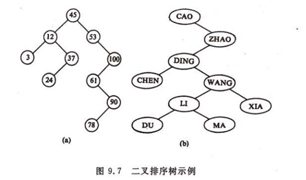
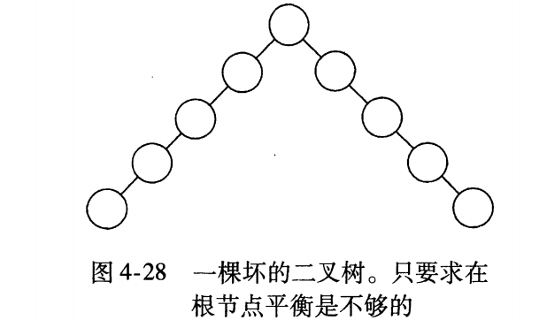
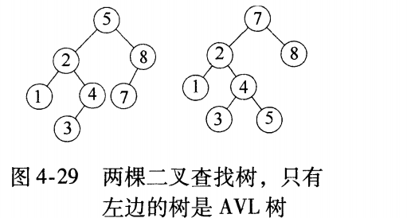
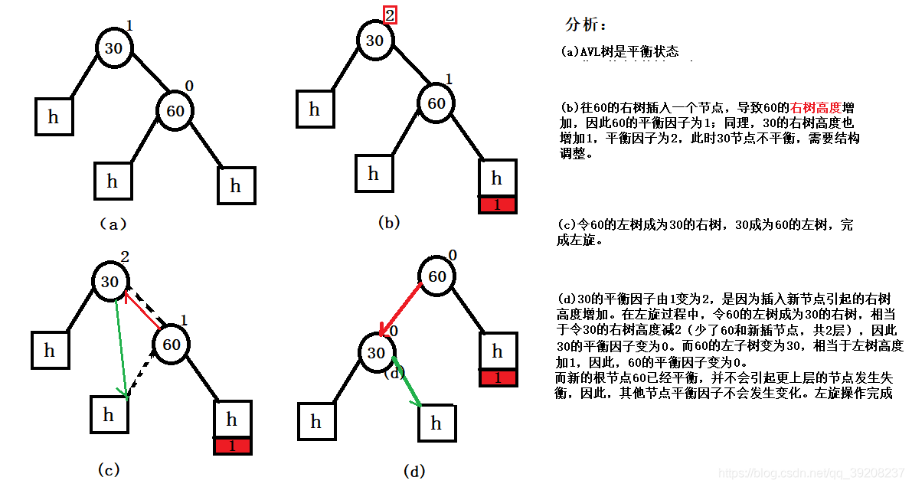
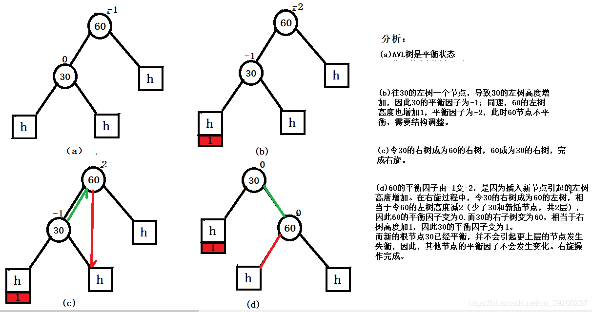

# 二叉树

## 一、排序二叉树(Binary Sort Tree，BST树)

二叉排序树，又叫二叉搜索树、有序二叉树（ordered binary tree）或排序二叉树（sorted binary tree）。

### 1.BST树的特点

排序二叉树要么是一棵空二叉树，要么是具有下列性质的二叉树：

-   若它的左子树不空，则左子树上所有节点的值均小于它的根节点的值
-   若它的右子树不空，则右子树上所有节点的值均大于它的根节点的值
-   它的左、右子树也分别为排序二叉树
-   没有键值相等的节点

**由排序二叉树的特点，我们很容易得出这样的结论：按中序遍历排序二叉树可以得到由小到大的有序序列**

### 2.BST树的缺点

排序二叉树虽然可以快速检索，但出现最坏的情况——如果插入的节点集本身就是有序的(从小到大排列或从大到小排列)，在这种情况下，排序二叉树就退化成了普通链表，其检索效率就会很差。 

## 二、平衡树

为了保证不退化成线性查找，就要维持树的平衡。这个平衡条件要容易保持，从而保证树的深度为O(logN)，很容易想到两种平衡条件：

1.  最简单的是要求左右子树具有相同的高度。
2.  另一种是要求每个节点都必须有相同高度的左子树和右子树。

然而，这两种要求都太严格而难以使用。

### 1.AVL树(Adelson-Velskii 和 Laandis)

AVL树得名于它的发明者 G.M. Adelson-Velsky 和 E.M. Landis，是最早被发明的一种平衡树。平衡二叉树本质上还是一颗二叉查找树，只是带上了平衡条件。

一棵平衡二叉树是每个节点的左子树和右子树的高度最多差1的二叉查找树。

-   平衡二叉树是带有平衡条件的二叉查找树
-   平衡二叉树的每个节点的左子树和右子树的高度最多差1

#### **1.1AVL树的特点**

AVL树中的每个节点的左子树和右子树的高度差不会大于1。在插入时，检查新节点的插入点所在的最低子树的根。如果它的子节点的高度相差大于1，则会破坏原有的平衡性，因此需要进行旋转操作以达到再次平衡，此时会执行一次或两次旋转使他们的高度相等。然后算法向上移动，检查上面的节点，必要时均衡高度。这个检测检查所有路径一直向上，直到根为止。

#### **1.2.AVL树的缺点**

由于插入(或删除)一个节点时需要扫描两趟树，一次向下查找插入点，一次向上平衡树，所以AVL树不如下面介绍的红黑树效率高，也不如红黑树常用。

(也就是说为了保持平衡，平衡二叉树定义节点的左子树和右子树的高度差不大于1，这种规定过于严格，导致在做插入或删除操作时需要自底向上逐层检查节点的平衡性(高度差)，因此效率较低)

#### **1.2.AVL树旋转**

 

### 2.红黑树(Red-Black Tree)

红黑树是二叉搜索树的一种改进，是另一种平衡树。我们知道二叉搜索树在最坏的情况下退化成了一个链表，而红黑树在每一次插入或删除节点之后都会花O(log N)的时间来对树的结构作修改，以保持树的平衡。也就是说，红黑树的查找方法与二叉搜索树完全一样；插入和删除节点的方法前半部分与二叉搜索树完全一样，而后半部分添加了一些修改树的结构的操作。

红黑树的定义：

1.  每个节点是红色或者黑色
2.  根节点是黑色
3.  每个叶子节点都是黑色的(这里的叶子节点指的并非指6,11,15,22,27这样的节点，而是图中的NIL节点，表示这是树的尾端。)
4.  对于任意的一个节点，其到尾端节点(NIL)的路径都包含了相同数目的黑节点。

参考：[一步一图一代码,一定要让你真正彻底明白红黑树](https://blog.csdn.net/chenhuajie123/article/details/11951777)

## 三、平衡多路查找树

前面讲的BST、AVL、红黑树都是典型的**二叉**查找树结构，其查找的时间复杂度与树高相关。那么降低树高自然对查找效率是有所帮助的。另外还有一个比较实际的问题：就是在大量数据存储中实现查询的场景下，平衡二叉树由于树深度过大而造成磁盘IO读写过于频繁，进而导致效率低下。那么如何减少树的深度（当然不能减少查询数据量），一个基本的想法就是：

①. 每个节点存储多个元素 （但元素数量不能无限多，否则查找就退化成了节点内部的线性查找了）。

②. 摒弃二叉树结构而采用多分支(多叉)树（由于节点内元素数量不能无限多，自然子树的数量也就不会无限多了）。

这样我们就提出了一个新的查找树结构 ——多路查找树。 根据AVL给我们的启发，一颗平衡多路查找树(B树)自然可以使得数据的查找效率保证在O(logN)这样的对数级别上。

### 1.B-树 (B树，平衡多路查找树)

可参考：《算法导论》第18章B树

**注意，这里的B-Tree中的减号只是分隔符，我们通常在书或博客中见到的B-Tree或者B~Tree实际上指的都是B树。**

B树是为磁盘或其他直接存储的辅助设备而设计的一种平衡搜索树。B树类似于红黑树，但它们在降低磁盘I/O操作次数方面要更好一些。许多数据库使用B树或B树的变种来存储信息。B树与红黑树不同之处在于B树的节点可以有多个孩子。B树类似于红黑树，就是含有n个节点的B树的高度为O(lgn)。

#### 1.1B树的定义

一棵m阶的B-Tree有如下特性：   
　　1. 每个节点最多有m个孩子。   
　　2. 除了根节点和叶子节点外，其它每个节点至少有Ceil(m/2)个孩子。   
　　3. 若根节点不是叶子节点，则至少有2个孩子   
　　4. 所有叶子节点都在同一层，且不包含其它关键字信息   
　　5. 每个非终端节点包含n个关键字信息（P0,P1,…Pn, k1,…kn）   
　　6. 关键字的个数n满足：ceil(m/2)-1 <= n <= m-1   
　　7. ki(i=1,…n)为关键字，且关键字升序排序。   
　　8. Pi(i=1,…n)为指向子树根节点的指针。P(i-1)指向的子树的所有节点关键字均小于ki，但都大于k(i-1)

#### 1.2B树的结构

B-Tree中的每个节点根据实际情况可以包含大量的关键字信息和分支，如下图所示为一个3阶的B-Tree：

每个节点占用一个盘块的磁盘空间，一个节点上有两个升序排序的关键字和三个指向子树根节点的指针，指针存储的是子节点所在磁盘块的地址。两个关键词划分成的三个范围域对应三个指针指向的子树的数据的范围域。以根节点为例，关键字为17和35，P1指针指向的子树的数据范围为小于17，P2指针指向的子树的数据范围为17~35，P3指针指向的子树的数据范围为大于35。

#### 1.3B树的查找过程

查找关键字29的过程：

1.  根据根节点找到磁盘块1，读入内存。【磁盘I/O操作第1次】
2.  比较关键字29在区间（17,35），找到磁盘块1的指针P2。
3.  根据P2指针找到磁盘块3，读入内存。【磁盘I/O操作第2次】
4.  比较关键字29在区间（26,30），找到磁盘块3的指针P2。
5.  根据P2指针找到磁盘块8，读入内存。【磁盘I/O操作第3次】
6.  在磁盘块8中的关键字列表中找到关键字29。

由于节点内部的关键字是有序的，所以在节点内部的查找可以使用二分法进行。

分析上面过程，发现需要3次磁盘I/O操作，和3次内存查找操作。由于内存中的关键字是一个有序表结构，可以利用二分法查找提高效率。而3次磁盘I/O操作是影响整个B-Tree查找效率的决定因素。B-Tree相对于AVLTree缩减了节点个数，使每次磁盘I/O取到内存的数据都发挥了作用，从而提高了查询效率。

### 2.B+树

B+树是B树的一种变种和优化，使其更适合实现外存储索引结构，InnoDB存储引擎就是用B+Tree实现其索引结构。B+树的特点是能够保持数据稳定有序，其插入与修改拥有较稳定的对数时间复杂度。B+树元素自底向上插入，这与二叉树恰好相反。

从上面的B-Tree结构图中可以看到每个节点中不仅包含数据的key值，还有data值。而每一个页的存储空间是有限的，如果data数据较大时将会导致每个节点（即一个页）能存储的key的数量很小，当存储的数据量很大时同样会导致B-Tree的深度较大，增大查询时的磁盘I/O次数，进而影响查询效率。在B+Tree中，所有数据记录节点都是按照键值大小顺序存放在同一层的叶子节点上，而非叶子节点上只存储key值信息，这样可以大大加大每个节点存储的key值数量，降低B+Tree的高度。

#### **B+Tree相对于B-Tree的不同点：**

**①节点存储的信息不同：**

B+树的分支结点仅仅存储着关键字信息和儿子的指针（这里的指针指的是磁盘块的偏移量），也就是说内部结点仅仅包含着索引信息。

B树的节点存储了索引信息和数据。

**②数据存储的位置不同:**

B+树中的数据都存储在叶子结点上，也就是其所有叶子结点的数据组合起来就是完整的数据。但B树的数据存储在每一个结点中，并不仅仅存储在叶子结点上。

**③查找路径不同：**

B+树的所有叶子节点都通过指针相连，每次查找都通过内部节点找到对应的叶子节点，从而获取到数据。顺序查找和区间查找也是这样，从内部节点定位到叶子节点，再在叶子节点中顺序查找。

B树则是每个节点都带有数据，找到了即停止查找，可能在内部节点中找到，也可能在叶子节点中找到。而区间查找则需要在上下层中不停的穿梭。

**④另外：**

B树在内部节点出现的索引项不会再出现在叶子节点中。**(???待确定)**

将上一节中的B树优化，由于B+Tree的非叶子节点只存储键值信息，假设每个磁盘块能存储4个键值及指针信息，则变成B+Tree后其结构如下图所示： 

通常在B+Tree上有两个头指针，一个指向根节点，另一个指向关键字最小的叶子节点，而且所有叶子节点（即数据节点）之间是一种链式环结构。因此可以对B+Tree进行两种查找运算：一种是对于主键的范围查找和分页查找，另一种是从根节点开始，进行随机查找。

#### Mysql索引中B+树通的高度通常为2~4层，那么这是为什么呢？

InnoDB存储引擎中页的大小为16KB，一般表的主键类型为INT（占用4个字节）或BIGINT（占用8个字节），指针类型也一般为4或8个字节，也就是说一个页（B+Tree中的一个节点）中大概存储16KB/(8B+8B)=1K个键值（因为是估值，为方便计算，这里的K取值为〖10〗^3）。也就是说一个深度为3的B+Tree索引可以维护10^3 \* 10^3 \* 10^3 = 10亿 条记录。实际情况中每个节点可能不会填充满，因此在数据库中，B+Tree的高度一般都在2~4层。

MySQL的InnoDB存储引擎在设计时是将根节点常驻内存的(少了一次磁盘IO)，也就是说查找某一键值的行记录时最多只需要1~3次磁盘I/O操作。所以B+树适合用来实现文件索引。

### 3.B\*树

B\*树是B+树的变体，在B+Tree的非根和非叶子结点再增加指向兄弟的指针；

## 问题：**有了二叉查找树、平衡树（AVL），为啥还需要红黑树？**

答：极端情况下，二叉树会退化成链表，时间复杂度从O(logn)退化为O(n)。所以有了平衡二叉树。

平衡二叉树对平衡的要求过于严格——每个节点的左右子树的高度差最多为1。这样导致每次进行插入或删除时都会破坏平衡规则，需要进行左旋和右旋来调整。所以有了红黑树。红黑树的特点如下：

红黑树具有如下特点：

1、具有二叉查找树的特点。

2、根节点是黑色的；

3、每个叶子节点都是黑色的空节点（NIL），也就是说，叶子节点不存数据。

4、任何相邻的节点都不能同时为红色，也就是说，红色节点是被黑色节点隔开的。

5、每个节点，从该节点到达其可达的叶子节点是所有路径，都包含相同数目的黑色节点。

正是由于红黑树的这种特点，使得它能够在最坏情况下，也能在 O(logn) 的时间复杂度查找到某个节点。

不过与平衡树不同的是，红黑树在插入、删除等操作时不会像平衡树那样频繁着破坏红黑树的规则，所以不需要频繁的调整，这也是我们为什么大多数情况下使用红黑树的原因。

但是，单单在查找效率方面，平衡树比红黑树快。所以，红黑树是一种不大严格的平衡树，可以说是一个折中发方案。

总之：平衡树是为了解决二叉查找树退化为链表的情况，而红黑树是为了解决平衡树在插入、删除等操作需要频繁调整的情况。

参考：

[一步步分析为什么B+树适合作为索引的结构](https://blog.csdn.net/weixin_30531261/article/details/79312676)

[Mysql索引分析](https://blog.csdn.net/u013235478/article/details/50625677)