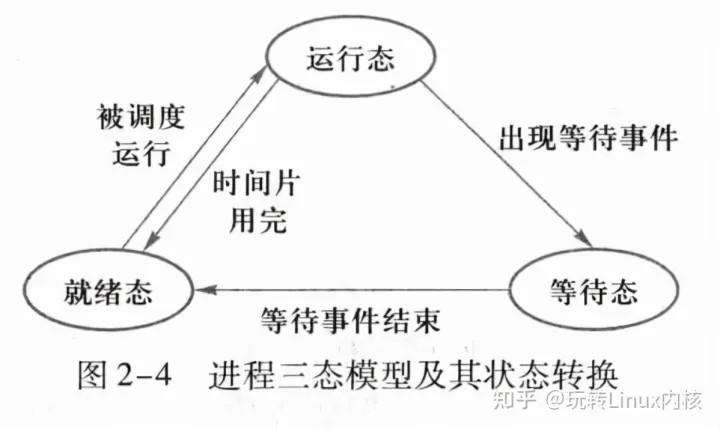
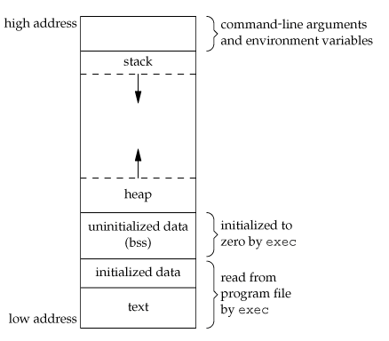
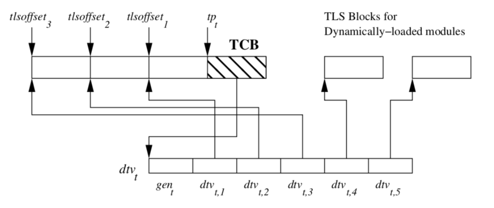

# 进程

## 进程状态转换



## 多进程

### 进程通信方法
1. 管道/无名管道
2. 信号
3. 共享内存
4. 信息量
5. 消息队列
6. Socket

### 线程通信方法
1. 信息量
2. 读写锁
3. 条件变量
4. 互斥锁
5. 信号

### 进程空间模型
内存分布分为5个部分，从高地址到低地址一次为：
1. 栈区（stack）
2. 堆区（heap）
3. 未初始化数据段（uninitialized data）
4. 初始化数据段（initialize data）
5. 代码段（text）。



### fork函数执行过程

1. 给新进程分配一个标识符
2. 在内核中分配一个PCB,将其挂在PCB表上
3. 复制它的父进程的环境（PCB中大部分的内容）
4. 为其分配资源（程序、数据、栈等）
5. 复制父进程地址空间里的内容（代码共享，数据写时拷贝）
6. 将进程置成就绪状态，并将其放入就绪队列，等待CPU调度。

### 子进程会继承父进程的哪些

1. 用户号UIDs和用户组号GIDs
2. 环境
3. 堆栈
4. 共享内存
5. 打开文件的描述符
6. 执行时关闭标志
7. 信号控制
8. 进程组号
9. 当前工作目录
10. 根目录
11. 文件方式创建屏蔽字
12. 资源限制
13. 控制中断

## 进程和线程

### 区别
1. 进程是计算机资源（CPU，内存）分配的基本单位。
2. 线程是计算机CPU调度与分配的基本单位，也就是程序执行的最小单位

### thread local变量底层原理

#### 线程结构体
```c
/* Thread descriptor data structure.  */
struct pthread
{
  union
  {
#if !TLS_DTV_AT_TP
    /* This overlaps the TCB as used for TLS without threads (see tls.h).  */
    tcbhead_t header;
#else
...

typedef struct
{
  void *tcb;            /* Pointer to the TCB.  Not necessarily the
                           thread descriptor used by libpthread.  */
  dtv_t *dtv;
  void *self;           /* Pointer to the thread descriptor.  */
  int multiple_threads;
  int gscope_flag;
  uintptr_t sysinfo;
  uintptr_t stack_guard;
  uintptr_t pointer_guard;
  unsigned long int unused_vgetcpu_cache[2];
...
} tcbhead_t;
```

#### TLS存储图


#### 详细解释

1. 每个线程有一个dtv_t *dtv, 也就是TLS数组
2. dtv记录了每个TLS的偏移量
3. 每个线程会利用FS寄存器保存TLS基地址位置
4. 线程被调度运行时, 会将相关寄存器值加载到cpu
5. 访问某个TLS时, 使用FS保存的`基地址+TLS偏移量`即可找到对应变量