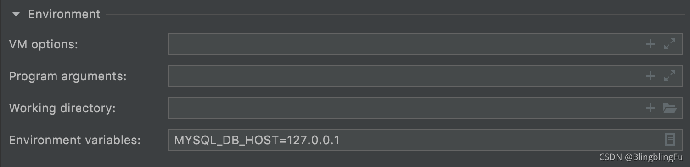
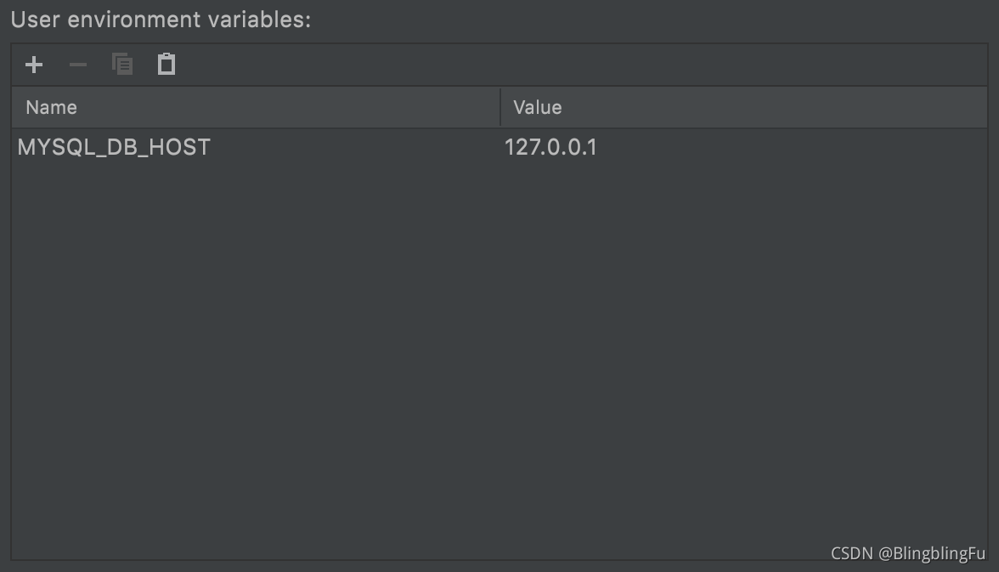

在Terminal中，输入`env`就会得到当前终端的环境变量。
在开发软件的过程中，有些值是需要随着环境改变的，比如数据库的IP端口，用户名等。我们不能把这些值硬编码进入代码中，再打包成jar包，这样使用起来是很不方便的。所以我们需要`env`，在启动jar包的时候传入变量。

在`application.properties`中，我们只需要使用`${变量名}`就可以声明一个使用环境变量的值，比如

```properties
server.port=${SERVER_PORT}
```

如果想向这个值声明一个默认值，以确保未在环境变量中找到此值时不会出错，使用`${变量名:默认值}`即可，比如

```properties
server.port=${SERVER_PORT:8080}
```

在开发中，使用IntelliJ IDEA修改启动配置，即可在开发环境中对这些变量进行配置。


点击Environment Variables编辑栏最右侧的按钮，就可以对多个环境变量进行设置：  


如果这样，将项目构建成Docker镜像时，需要在Dockerfile中新增Env变量：

```properties
ENV MYSQL_DB_HOST='127.0.0.1' MYSQL_DB_PORT=3306 MYSQL_DB_USERNAME='root'
```

在启动容器时，需要使用-v参数来声明环境变量，或者在docker-compose文件中声明environment来实现对环境变量的正确赋值。