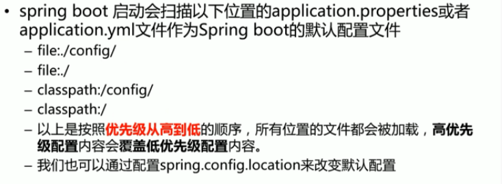
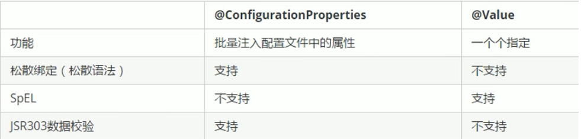

# SpringBoot四种读取properties文件的方式

---

## 配置文件加载位置



## 前提
### 可选依赖
此依赖可以使配置文件有提示
```xml
<dependency>
    <groupId>org.springframework.boot</groupId>
    <artifactId>spring-boot-configuration-processor</artifactId>
    <optional>true</optional>
</dependency>
```

### 注意事项
application.properties文件中的属性可以使用“-”、“_”或者小驼峰写法，且必须和配置类中的属性名对应

## 一、使用`@ConfigurationProperties`注解将配置文件属性注入到自定义配置对象类中

### 示例
```java
@Data
@Component
@ConfigurationProperties(prefix = "xxx")
//PropertySource默认application.properties
@PropertySource(value = "xxx.properties")
public class XxxProperties{
    
}
```

### 解释
```shell
@Configuration 表明这是一个配置类
@ConfigurationProperties(prefix = "remote", ignoreUnknownFields = false) 该注解用于绑定属性。prefix用来选择属性的前缀，也就是在remote.properties文件中的“remote”，ignoreUnknownFields是用来告诉SpringBoot在有属性不能匹配到声明的域时抛出异常。
@PropertySource("classpath:config/remote.properties") 配置文件路径
@Data 这个是一个lombok注解，用于生成getter&setter方法，详情请查阅lombok相关资料
@Component 标识为Bean
```

### 使用方式
```java
@Autowired
RemoteProperties remoteProperties;
```

## 二、使用`@Value("${propertyName}")`注解，在需要使用的类中使用成员变量
### 示例
```java
@Component
public class Config{
    @Value(${name})
    private String name;
}
```

## 三、使用Environment，在任何想要用的地方直接获取值
```java
private Enviroment env;

env.getProperty("xxx");
```

## 四、使用PropertiesLoaderUtils
```
private static String[] getServerInfo(String label){
        String[] arr = new String[2];
        try {
            Properties properties = PropertiesLoaderUtils.loadAllProperties("server.properties");
            arr[0] = properties.getProperty("server.ip");
            arr[1] = properties.getProperty("server.port");
        }catch (IOException ioe){
            ioe.printStackTrace();
        }
        return arr;
    }
}
```

## 总结
### @Value和@ConfigurationProperties区别



### 补充

此外，对于spring boot的组件配置，spring boot会自动从配置文件中获取配置，比如KafkaTemplate