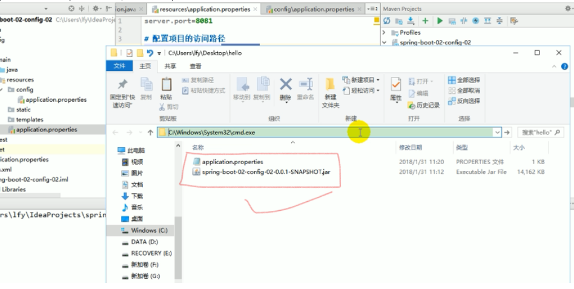

# Spring Boot读取外部配置

---

## maven打包规则
只打包类路径下的文件，也就是打包src/main/java和src/main/resources目录下的文件

## 外部配置加载顺序
以下位置优先级由高到低，高优先级会覆盖低优先级，所有配置会互补
1. 命令行参数
2. 来自java:comp/env的JNDI属性
3. Java系统属性（System.getProperties()）
4. 操作系统环境变量
5. RandomValuePropertySource配置的random.*属性值
6. jar包==外部==的application-{profile}.properties或application.yml（带spring.profile的）配置文件
7. jar包==内部==的application-{profile}.properties或application.yml（带spring.profile的）配置文件
8. jar包==外部==的application.properties或application.yml（不带spring.profile的）配置文件
9. jar包==内部==的application.properties或application.yml（不带spring.profile的）配置文件
10. @Configuration注解类上的@PropertySource
11. 通过SpringApplication.setDefaultProperties指定的默认属性

##  自定义外部配置
在jar包同级目录创建config目录，将custom.yaml放进config目录
源码中需要修改。`此种方式在SpringBoot2.5.1以下版本有bug`
```java
@ConfigurationProperties(prefix = "spring.data.mongodb")
@PropertySource(value = {"classpath:custom.yaml", "file:config/custom.yaml"}, factory = YamlPropertySourceFactory.class ,ignoreResourceNotFound = false)
```

## 举例

1. 命令行参数
    ```shell
    java -jar xxx.SNAPSHOT --server.port=8080
    ```
2. jar外部优先加载带profile的文件，再加载不带profile的文件
