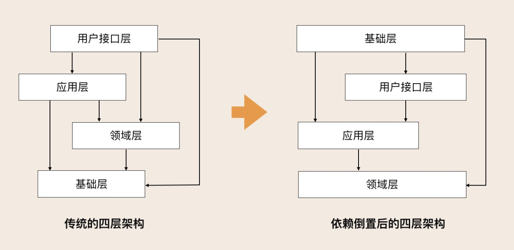
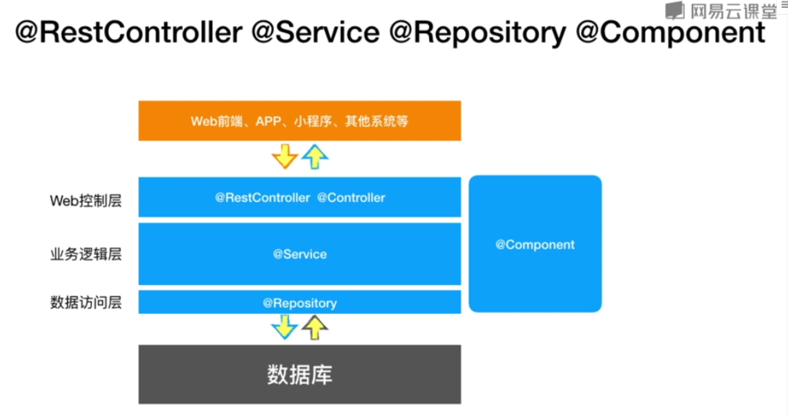

# 后端分层

## DDD分层



`不要为了DDD而使用DDD`

## mvc 分层



@Repository，标志DAO层

@Service，标志业务层，在实现类前标志要跟bean同名

@Controller，标志控制层

@Component，不确定是哪一层的时候标志

## 领域模型命名规约
1. 数据对象：xxxDO，xxx 即为数据表名。DAO层返回。
2. 数据传输对象：xxxDTO，xxx 为业务领域相关的名称。service层返回
3. 展示对象：xxxVO，xxx 一般为网页名称。controller层返回
4. POJO 是 DO/DTO/BO/VO 的统称，禁止命名成 xxxPOJO。

## 项目分层与目录总结

### 整个软件分为三大层(DDD)
1. infrastructure：基础设施
2. service（domain）：服务层
3. controller（application）：应用层

### 项目目录结构

1. 代码目录结构
    ```sh
    # 基础层
    |_common: 
        |__utils: 放置utils
        |__exception: 放置自定义exception
    |_annotation：放置项目自定义注解
    |_aspect：放置切面代码
    |_config：放置配置类
    |_constant：放置常量、枚举等定义
        |__consist：存放常量定义
        |__enums：存放枚举定义
    |_filter：放置一些过滤、拦截相关的代码
    |_mapper：放置数据访问层代码接口
    |_model：放置数据模型代码
        |__entity：放置数据库实体对象定义
        |__vo：存放显示层对象定义
        |__dto: 可以选择不使用（有vo足够）
    # 服务层
    |_service：放置具体的业务逻辑代码（接口和实现分离，传入参数都应该为entity）
        |__intf：存放业务逻辑接口定义
        |__impl：存放业务逻辑实际实现
    # 应用层
    |_controller：放置控制器代码
    ```

2. 资源目录结构
    ```sh
    |_resources: 
        |_mapper：存放mybatis的XML映射文件（如果是mybatis项目）
        |_static：存放网页静态资源，比如下面的js/css/img
            |__js：
            |__css：
            |__img：
            |__font：
            |__等等
        |_template：存放网页模板，比如thymeleaf/freemarker模板等
            |__header
            |__sidebar
            |__bottom
            |__XXX.html等等
        |_application.yml       基本配置文件
        |_application-dev.yml   开发环境配置文件
        |_application-test.yml  测试环境配置文件
        |_application-prod.yml  生产环境配置文件
    ```