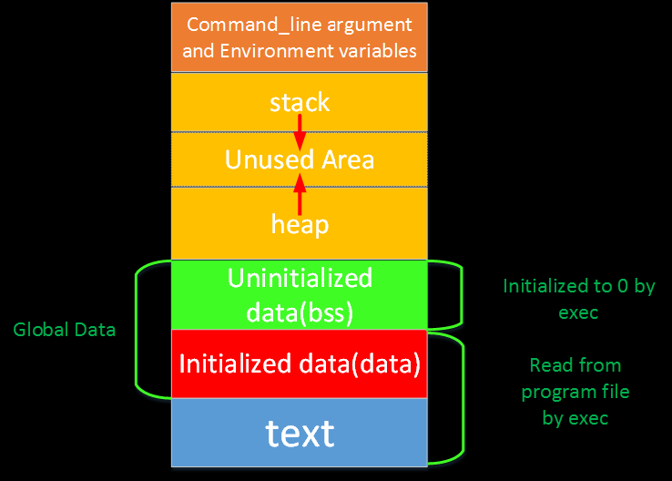

# Linux内存分布

---

## 概述

## 相关名词
1. rss：常驻内存，表示该进程分配的内存大小。RSS不包括进入交换分区的内存。RSS包括共享库占用的内存（只要共享库在内存中）RSS包括所有分配的栈内存和堆内存。
2. vms：“虚拟内存大小”，这是进程使用的虚拟内存总量。在UNIX上，它匹配“top”的VIRT列。在Windows上，这是pagefile字段的别名，它与的“Mem Usage”“VM Size”列匹配taskmgr.exe。假如进程申请100m的内存，但实际只使用了10m，那么它会增长100m，而不是实际的使用量。
3. shared：可能与其他进程共享的内存。这与“top”的SHR列匹配。计算某个进程所占的物理内存大小公式：RES – SHR。
4. text：程序段，程序代码在内存中的映射，存放函数体的二进制代码。
5. lib：共享库使用的内存。
6. data：静态数据。
7. dirt：脏页数。