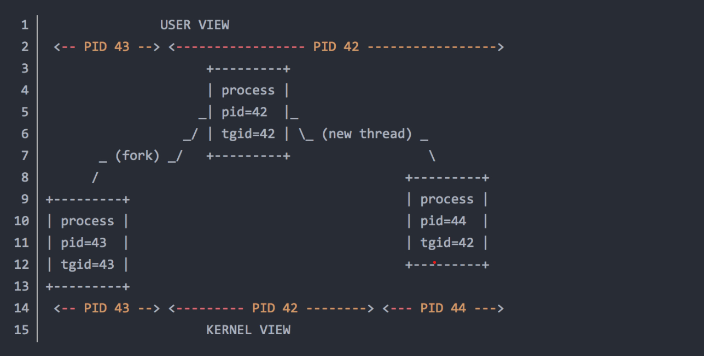

# Linux线程模型

---

## 概述
Linux历史上，最开始使用的线程是LinuxThreads，但LinuxThreads有些方面受限于内核的特性，从而违背了SUSV3 Pthreads标准。即它要根据内核的特性来实现线程，有些地方没有遵循统一的标准。后来IBM开发了NGPT(Next Generation POSIX Threads)，性能明显优于LinuxThreads，人们曾把它当作LinuxThreads的继任者。但最后，又有一个项目NPTL(Native POSIX Threads Library)出来后，性能更优于NGPT。2002年NGPT项目停止开发，我们现在用的Linux线程就是NPTL。

线程的实现有3种模型：

1.多对一(M:1)的用户级线程模型

2.一对一(1:1)的内核级线程模型

3.多对多(M:N)的两级线程模型

上面的x对y(x:y)即x个用户线程对应y个内核调度实体(Kernel Scheduling Entity，这个是内核分配CPU的对象单位)。

LinuxThreads和NPTL都是采用一对一的线程模型，NGPT采用的是多对多的线程模型。

### 多对一用户线级程模型                      

多对一线程模型中，线程的创建、调度、同步的所有细节全部由进程的用户空间线程库来处理。用户态线程的很多操作对内核来说都是透明的，因为不需要内核来接管，这意味不需要内核态和用户态频繁切换。线程的创建、调度、同步处理速度非常快。当然线程的一些其他操作还是要经过内核，如IO读写。这样导致了一个问题：当多线程并发执行时，如果其中一个线程执行IO操作时，内核接管这个操作，如果IO阻塞，用户态的其他线程都会被阻塞，因为这些线程都对应同一个内核调度实体。在多处理器机器上，内核不知道用户态有这些线程，无法把它们调度到其他处理器，也无法通过优先级来调度。这对线程的使用是没有意义的！

### 一对一内核极线程模型                      

一对一模型中，每个用户线程都对应各自的内核调度实体。内核会对每个线程进行调度，可以调度到其他处理器上面。当然由内核来调度的结果就是：线程的每次操作会在用户态和内核态切换。另外，内核为每个线程都映射调度实体，如果系统出现大量线程，会对系统性能有影响。但该模型的实用性还是高于多对一的线程模型。

### 多对多两极线程模型                          

多对多模型中，结合了1：1和M：1的优点，避免了它们的缺点。每个线程可以拥有多个调度实体，也可以多个线程对应一个调度实体。听起来好像非常完美，但线程的调度需要由内核态和用户态一起来实现。可想而知，多个对象操作一个东西时，肯定要一些其他的同步机制。用户态和内核态的分工合作导致实现该模型非常复杂。NPTL曾经也想使用该模型，但它太复杂，要对内核进行大范围改动，所以还是采用了一对一的模型。

### 查看linux上pthread版本
```shell
getconf GNU_LIBPTHREAD_VERSION
```

## Linux的进程和线程
### 说明
1. 进程是资源分配的基本单位，线程是调度的基本单位
2. 进程是资源的集合，这些资源包括内存地址空间，文件描述符等等，一个进程中的多个线程共享这些资源。
3. CPU对任务进行调度时，可调度的基本单位 (dispatchable entity)是线程。如果一个进程中没有其他线程，可以理解成这个进程中只有一个主线程，这个主进程独享进程中的所有资源。
4. 进程的个体间是完全独立的，而线程间是彼此依存，并且共享资源。多进程环境中，任何一个进程的终止，不会影响到其他非子进程。而多线程环境中，父线程终止，全部子线程被迫终止(没有了资源)。

上述第一点说明是最基础的，也是最重要的。

### 初步理解各种ID
基本上按照重要程度从高到低，在分割线下方的IDs不太重要。

+ pid: 进程ID。
+ lwp: 线程ID。在用户态的命令(比如ps)中常用的显示方式。
+ tid: 线程ID，等于lwp。tid在系统提供的接口函数中更常用，比如syscall(SYS_gettid)和syscall(__NR_gettid)。
+ tgid: 线程组ID，也就是线程组leader的进程ID，等于pid。
+ 分割线-------------------------------分割线
+ pgid: 进程组ID，也就是进程组leader的进程ID。
+ pthread id: pthread库提供的ID，生效范围不在系统级别，可以忽略。
+ sid: session ID for the session leader。
+ tpgid: tty process group ID for the process group leader。

从上面的列表看出，各种ID最后都归结到pid和lwp(tid)上。所以理解各种ID，最终归结为理解pid和lwp(tid)的联系和区别。
 
下面的图是一张描述父子进程，线程之间关系的图。

 
上图很好地描述了用户视角(user view)和内核视角(kernel view)看到线程的差别：

+ 从用户视角出发，在pid 42中产生的tid 44线程，属于tgid(线程组leader的进程ID) 42。甚至用ps和top的默认参数，你都无法看到tid 44线程。
+ 从内核视角出发，tid 42和tid 44是独立的调度单元，可以把他们视为"pid 42"和"pid 44"。

### linxu轻量级进程
轻量级进程就是linux所谓的“线程”，它只是共享了父进程很多资源如进程地址空间，文件描述符和信号量等，而独立的资源只有任务描述符task_struct，内核栈等与调度有关的，做到了：资源共享，调度独立。