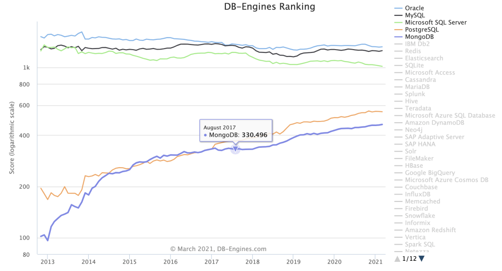
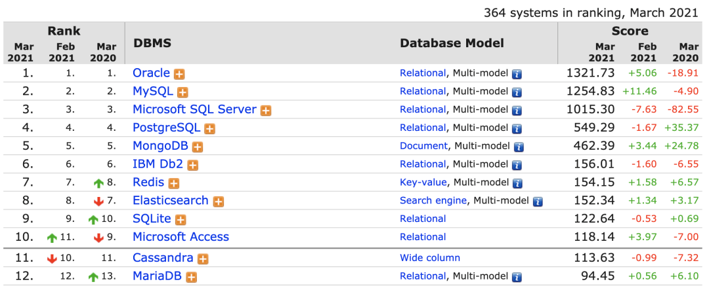
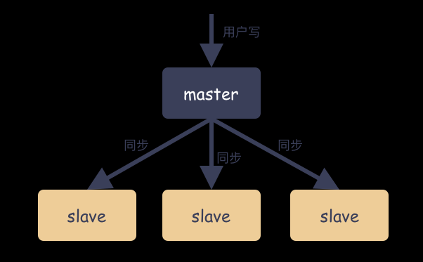
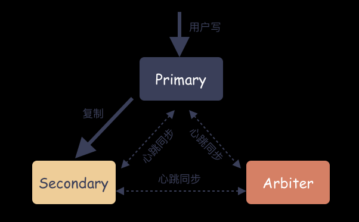
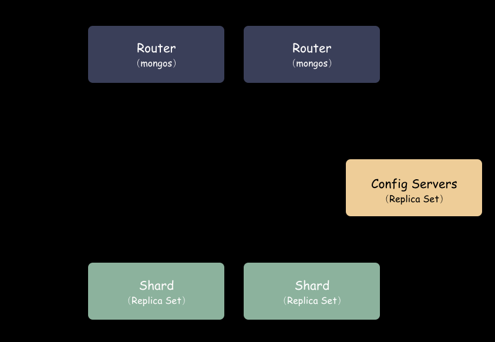
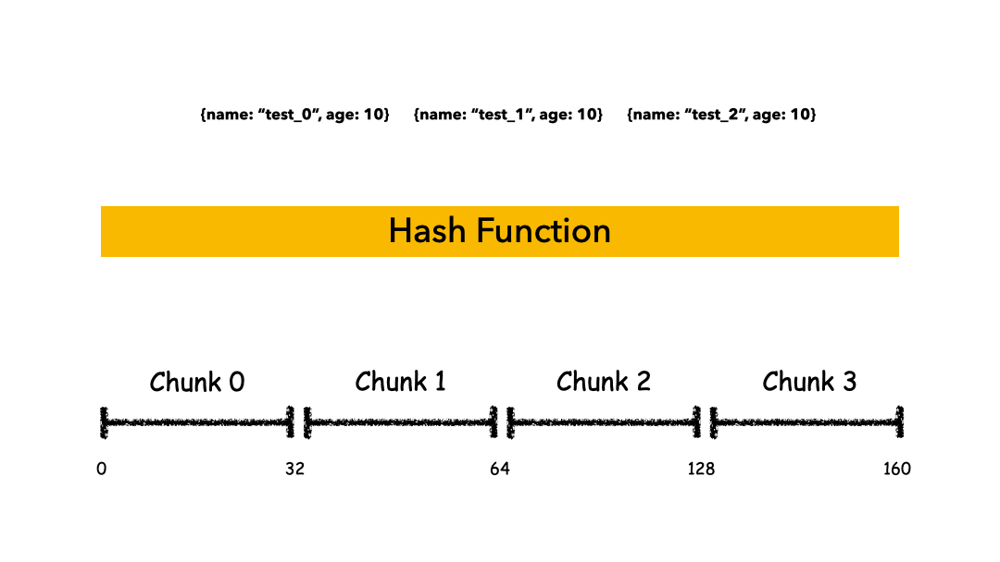
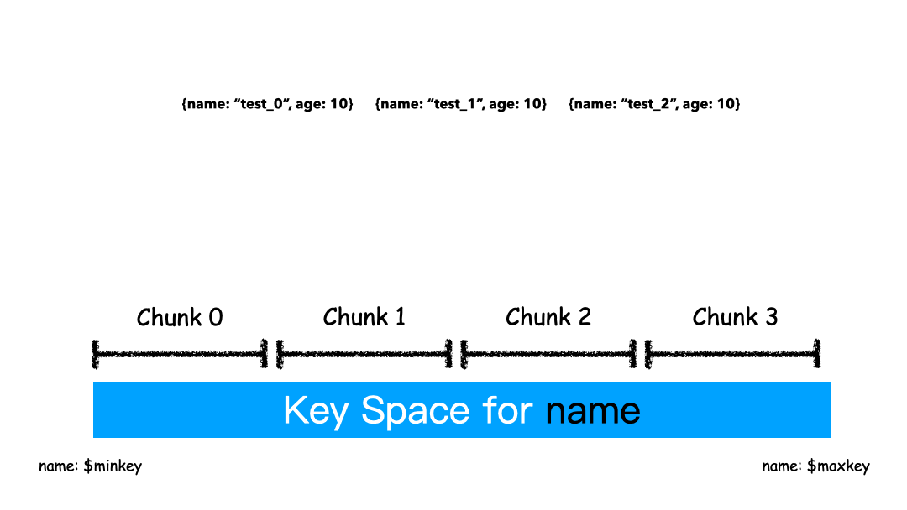

# MongoDB高可用架构

## **MongoDB 背景**
    
MongoDB 是一款功能完善的分布式文档数据库，是一款非常出名的 NoSQL 数据库。当前国内使用 Mongodb 的大型实践越来越多，MongoDB 为我司提供了重要的数据库存储服务，支撑着每天近千万级 QPS 峰值读写，数万亿级数据量存储服务。

MongoDB 在高性能、动态扩缩容、高可用、易部署、易使用、海量数据存储等方面拥有很大优势。近些年，MongoDB 在 DB-Engines 流行度排行榜稳居榜单 Top5 ，且历年得分是持续增长的，具体如下图所示：

**DB-Engines 是一个对数据库管理系统受欢迎程度进行排名的网站**。
    

    

    
MongoDB 是 Top5 内的唯一的非关系型数据库。我们今天从比较高的层面来观摩学习下 MongoDB 的几种高可用。通过观察这几种架构我们甚至能体会到通用的分布式架构的一个演进方向。
    
## **高可用架构**

高可用性 HA（High Availability）指的是缩短因**正常运维**或者**非预期故障**而导致的停机时间，提高系统可用性。
    
那么问题来了，都说自己的服务高可用，高可用能量化衡量吗？能不能比出个高低呢？
    
**可以，这里引出一个 SLA 的概念**。SLA 是 Service Level Agreement 的缩写，中文含义：服务等级协议。SLA 就是用来量化可用性的协议，在双方认可的前提条件下，服务提供商与用户间定义的一种双方认可的协定。SLA 是判定服务质量的重要指标。
    
问题来了，SLA 是怎么量化的？其实就是按照停服时间算的。怎么算的？举个例子：

$$ 
1 年 = 365 天 = 8760 小时 \\
99.9 停服时 = 8760 * 0.1 = 8760 * 0.001 = 8.76小时 \\
99.99 停服时间 = 8760 * 0.0001 = 0.876 小时 = 52.6 分钟 \\
99.999 停服时间：8760 * 0.00001 = 0.0876 小时 = 5.26分钟
$$
    
我们从 Mongo 的三种高可用模式逐一介绍，这三种模式也代表了通用分布式系统下高可用架构的进化史，分别是 Master-Slave，Replica Set，Sharding 模式。
    
## **Master-Slave 模式**
    
Mongodb 提供的第一种冗余策略就是 Master-Slave 策略，这个也是分布式系统最开始的冗余策略，这种是一种热备策略。
    
Master-Slave 架构一般用于备份或者做读写分离，一般是一主一从设计和一主多从设计。
    
Master-Slave 由主从角色构成：
    
- **Master ( 主 )**
    可读可写，当数据有修改的时候，会将 Oplog 同步到所有连接的Salve 上去。
- **Slave ( 从 )**
    只读，所有的 Slave 从 Master 同步数据，从节点与从节点之间不感知。

如图：
    

    
通过上面的图，这是一种典型的扇形结构。
    
### Master-Slave 对读写分离的思考

#### 数据不一致问题

根本原因在于只有 Master 节点可以写，Slave 节点只能同步 Master 数据并对外提供读服务，所以你会发现这个是一个异步的过程。
    
虽然最终数据会被 Slave 同步到，在数据完全一致之前，数据是不一致的，这个时候去 Slave 节点读就会读到旧的数据。所以，总结来说：**读写分离的结构只适合特定场景，对于必须需要数据强一致的场景是不合适这种读写分离的**。
    
    
#### Master-Slave 对容灾的思考
    
当 Master 节点出现故障的时候，由于 Slave 节点有备份数据，有数据就好办呀。只要有数据还在，对用户就有交代。这种 Master 故障的时候，可以通过人为 Check 和操作，手动把 Slave 节点指定为 Master 节点，这样又能对外提供服务了。
    
#### Master-Slave 的现状
    
MongoDB 3.6 起已不推荐使用主从模式，自 MongoDB 3.2 起，分片群集组件已弃用主从复制。因为 Master-Slave 其中 Master 宕机后不能自动恢复，只能靠人为操作，可靠性也差，操作不当就存在丢数据的风险。
    
## Replica Set 副本集模式
    
### Replica Set 模式角色
    
Replica Set 是 mongod 的实例集合，包含三类节点角色：
    
- **Primary（ 主节点 ）**
    只有 Primary 是可读可写的，Primary 接收所有的写请求，然后把数据同步到所有 Secondary 。一个 Replica Set 只有一个 Primary 节点，当 Primary 挂掉后，其他 Secondary 或者 Arbiter 节点会**重新选举**出来一个 Primary 节点，这样就又可以提供服务了。
    
    读请求默认是发到 Primary 节点处理，如果需要故意转发到 Secondary 需要客户端修改一下配置（注意：是客户端配置，决策权在客户端）。

    那有人又会想了，这里也存在 Primary 和 Secondary 节点角色的分类，岂不是也存在单点问题？

    这里和 Master-Slave 模式的最大区别在于，Primary 角色是通过整个集群共同选举出来的，人人都可能成为 Primary ，人人最开始只是  Secondary ，而这个选举过程完全自动，不需要人为参与。
    
- **Secondary（ 副本节点 ）**
    数据副本节点，当主节点挂掉的时候，参与选主。
    思考一个问题：Secondary 和 Master-Slave 模式的 Slave 角色有什么区别？
    最根本的一个不同在于：Secondary 相互有心跳，Secondary 可以作为数据源，Replica 可以是一种链式的复制模式。
- **Arbiter（ 仲裁者 ）**
    
    不存数据，不会被选为主，只进行选主投票。使用 Arbiter 可以减轻在减少数据的冗余备份，又能提供高可用的能力。
    如下图：
    
    
### **副本集模式特点思考**
    
#### MongoDB 的 Replica Set 副本集模式主要有以下几个特点：
    
- 数据多副本，在故障的时候，可以使用完的副本恢复服务。注意：**这里是故障自动恢复**
- 读写分离，读的请求分流到副本上，减轻主（Primary）的读压力；
- 节点直接互有心跳，可以感知集群的整体状态；
- **思考：这种有什么优缺点呢？**
    可用性大大增强，因为故障时自动恢复的，主节点故障，立马就能选出一个新的 Primary 节点。但是有一个要注意的点：每两个节点之间互有心跳，这种模式会导致节点的心跳几何倍数增大，单个 Replica Set 集群规模不能太大，一般来讲最大不要超过 50 个节点。
    
## Sharding 模式
    
按道理 Replica Set 模式已经非常好的解决了可用性问题，为什么还会往后演进呢？因为在当今大数据时代，有一个必须要考虑的问题：**就是数据量**。
用户的数据量是永远都在增加的，理论是没有上限的，但 Replica Set 却是有上限的。

**解决方案就是：利用分布式技术**。
解决性能和容量瓶颈一般来说优化有两个方向：
1.  纵向优化
2.  横向优化
    
**纵向优化**是传统企业最常见的思路，持续不断的加大单个磁盘和机器的容量和性能。CPU 主频不断的提升，核数也不断地加，磁盘容量从 128 GiB 变成当今普遍的 12 TiB，内存容量从以前的 M 级别变成现在上百 G 。带宽从以前百兆网卡变成现在的普遍的万兆网卡，但这些提升终究追不上用互联网数据规模的增加量级。
    
**横向优化**通俗来讲就是加节点，横向扩容来解决问题。业务上要划分系统数据集，并在多台服务器上处理，做到容量和能力跟机器数量成正比。单台计算机的整体速度或容量可能不高，但是每台计算机只能处理全部工作量的一部分，因此与单台高速大容量服务器相比，可能提供更高的效率。
    
MongoDB 的 Sharding 模式就是 MongoDB 横向扩容的一个架构实现。我们下面就看一下 Sharding 模式和之前 Replica Set 模式有什么特殊之处吧。
    
### Sharding 模式角色
    
Sharding 模式下按照层次划分可以分为 3 个大模块：
1.  代理层：mongos
2.  配置中心：副本集群（mongod）
3.  数据层：Shard 集群
    简要如下图：
    

    
**代理层**：
    代理层的组件也就是 mongos ，这是个无状态的组件，纯粹是路由功能。向上对接 Client ，收到 Client 写请求的时候，按照特定算法均衡散列到某一个 Shard 集群，然后数据就写到 Shard 集群了。收到读请求的时候，定位找到这个要读的对象在哪个 Shard 上，就把请求转发到这个 Shard 上，就能读到数据了。
**数据层**：
    数据层是啥？就是存储数据的地方。你会惊奇的发现，其实数据层就是由一个个 Replica Set 集群组成。在前面我们说过，单个 Replica Set 是有极限的，怎么办？那就搞多个 Replica Set ，**这样的一个 Replica Set 我们就叫做 Shard** 。理论上，Replica Set 的集群的个数是可以无限增长的。
**配置中心**：
    代理层是无状态的模块，数据层的每一个 Shard 是各自独立的，那总要有一个集群统配管理的地方，这个地方就是配置中心。里面记录的是什么呢？
    比如：有多少个 Shard，每个 Shard 集群又是由哪些节点组成的。每个 Shard 里大概存储了多少数据量（以便做均衡）。这些东西就是在配置中心的。
    配置中心存储的就是集群拓扑，管理的配置信息。这些信息也非常重要，所以也不能单点存储，怎么办？**配置中心也是一个 Replica Set 集群，数据也是多副本的**。
    详细架构图：
    
    
### **Sharding 模式怎么存储数据**
单 Shard 集群是有限的，但 Shard 数量是无限的，Mongo 理论上能够提供近乎无限的空间，能够不断的横向扩容。那么现在唯一要解决的就是怎么去把用户数据存到这些 Shard 里？MongDB 是怎么做的？
    
首先，要选一个字段（或者多个字段组合也可以）用来做 Key，这个 Key 可以是你任意指定的一个字段。我们现在就是要使用这个 Key 来，通过**某种策略**算出发往哪个 Shard 上。这个策略叫做：**Sharding Strategy** ，也就是分片策略。
    
我们把 Sharding Key 作为输入，按照特点的 Sharding Strategy 计算出一个值，**值的集合形成了一个值域**，我们按照固定步长去切分这个值域，**每一个片叫做 Chunk**, **每个 Chunk 出生的时候就和某个 Shard 绑定起来，这个绑定关系存储在配置中心里。**
    
所以，我们看到 MongoDB 的用 Chunk 再做了一层抽象层，隔离了用户数据和 Shard 的位置，用户数据先按照分片策略算出落在哪个 Chunk 上，由于 Chunk 某一时刻只属于某一个 Shard，所以自然就知道用户数据存到哪个 Shard 了。
    
Sharding 模式下数据写入过程：

Sharding 模式下数据读取过程：
    
通过上图我们也看出来了，mongos 作为路由模块其实就是寻路的组件，写的时候先算出用户 key 属于哪个 Chunk，然后找出这个 Chunk 属于哪个 Shard，最后把请求发给这个 Shard ，就能把数据写下去。读的时候也是类似，先算出用户 key 属于哪个 Chunk，然后找出这个 Chunk 属于哪个 Shard，最后把请求发给这个 Shard ，就能把数据读上来。
    
实际情况下，mongos 不需要每次都和 Config Server 交互，大部分情况下只需要把 Chunk 的映射表 cache 一份在 mongos 的内存，就能减少一次网络交互，提高性能。
    
#### 为什么要多一层 Chunk 这个抽象
    
**为了灵活**，因为一旦是用户数据直接映射到 Shard 上，那就相当于是用户数据和底下的物理位置绑定起来了，这个万一 Shard 空间已经满了，怎么办？
    
存储不了呀，又不能存储到其他地方去。有同学就会想了，那我可以把这个变化的映射记录下来呀，记录下来理论上行得通，但是每一个用户数据记录一条到 Shard 的映射，这个量级是非常大的，实际中没有可行性。
    
而现在多了一层 Chunk 空间，就灵活了。用户数据不再和物理位置绑定，而是只映射到 Chunk 上就可以了。如果某个 Shard 数据不均衡，那么可以把 Chunk 空间分裂开，迁走一半的数据到其他 Shard ，修改下 Chunk 到 Shard 的映射，**Chunk 到 Shard 的映射条目很少**，完全 Hold 住，并且这种均衡过程用户完全不感知。
    
讲回 Sharding Strategy 是什么？**本质上 Sharding Strategy 是形成值域的策略而已**，
##### MongoDB 支持两种 Sharding Strategy：
1.  Hashed Sharding 的方式
2.  Range Sharding 的方式
        
##### **Hashed Sharding**
    
把 Key 作为输入，输入到一个 Hash 函数中，计算出一个整数值，值的集合形成了一个值域，我们按照固定步长去切分这个值域，每一个片叫做 Chunk ，**这里的 Chunk 则就是整数的一段范围而已**。
    

    
这种计算值域的方式有什么优缺点呢？
    
###### 好处是：
-  计算速度快
-  均衡性好，纯随机
    
###### 坏处是：
    
-  正因为纯随机，排序**列举的性能极差**，比如你如果按照 name 这个字段去列举数据，你会发现几乎所有的 Shard 都要参与进来；
        
    
##### **Range Sharding**
    
**Range 的方式本质上是直接用 Key 本身来做值，形成的 Key Space 。**
    

    
如上图例子，Sharding Key 选为 name 这个字段，对于 $test\_0，test\_1，test\_2$ 这样的 key 排序就是挨着的，所以就全都分配在一个 Chunk 里。
    
这 3 条 Docuement 大概率是在一个 Chunk 上，因为我们就是按照 Name 来排序的。这种方式有什么优缺点？
    
##### 好处是

对`排序列举场景非常友好`，因为数据本来就是按照顺序依次放在 Shard 上的，排序列举的时候，顺序读即可，非常快速
  
##### 坏处是

`容易导致热点`，举个例子，如果 Sharding Key 都有相同前缀，那么大概率会分配到同一个 Shard 上，就盯着这个 Shard 写，其他 Shard 空闲的很，却帮不上忙
        
#### 可用性的进一步提升
    
因为 Shard（Replica Set）集群个数多了，即使一个或多个 Shard 不可用，Mongo 集群对外仍可以 提供读取和写入服务。因为每一个 Shard 都有一个 Primary 节点，都可以提供写服务，可用性进一步提升。