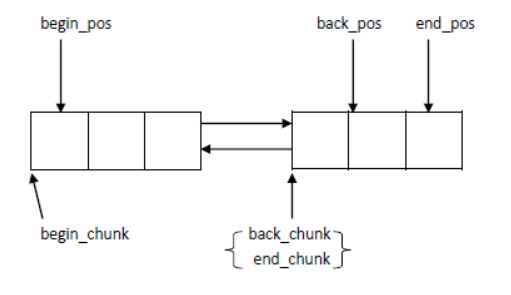

# ZeroMQ无锁队列ypipe_t

---

## yqueue_t
yqueue_t是一个高效的队列，高效体现在她的内存配置上，尽量少的申请内存，尽量重用将要释放的内存。其实，容器的设计都会涉及这点--高效的内存配置器，像sgi stl容器的内存配置器，使用了内存池，预先分配一块较大内存，用不同大小的桶管理，容器申请内存时从相应的桶里拿一块内存，释放内存时又把内存回收到相应的桶里，这样就能做到尽量少的malloc调用。yqueue_t并没有使用内存池，但是利用了同样的思想，一次性分配一个chunk_t减少内存分配次数，并用spare_chunk管理将要释放的块用于内存回收，详细的实现后面再说，先看一下yqueue_t的整个概况

```cpp
//  T is the type of the object in the queue.队列中元素的类型
    //  N is granularity(粒度) of the queue，简单来说就是yqueue_t一个结点可以装载N个T类型的元素，可以猜想yqueue_t的一个结点应该是个数组
    template <typename T, int N> class yqueue_t
    {
    public:
        inline yqueue_t ();//  Create the queue.
        inline ~yqueue_t ();//  Destroy the queue.   
        inline T &front ();//  Returns reference to the front element of the queue. If the queue is empty, behaviour is undefined.
        inline T &back ();//  Returns reference to the back element of the queue.If the queue is empty, behaviour is undefined.
        inline void push ();//  Adds an element to the back end of the queue.
        inline void pop ();//  Removes an element from the front of the queue.
        inline void unpush ()//  用于回滚操作，暂时先不管这个函数，用到再说
    private:
        //  Individual memory chunk to hold N elements.
        struct chunk_t
        {
             T values [N];
             chunk_t *prev;
             chunk_t *next;
        };

        chunk_t *begin_chunk;
        int begin_pos;
        chunk_t *back_chunk;
        int back_pos;
        chunk_t *end_chunk;
        int end_pos;

        atomic_ptr_t<chunk_t> spare_chunk;  //空闲块（我把所有元素都已经出队的块称为空闲块），读写线程的共享变量
    };
```

1. 可以看到，yqueue_t是采用双向链表实现的，链表结点称之为chunk_t，每个chunk_t可以容纳N个T类型的元素，以后就以一个chunk_t为单位申请内存，begin_chunk可以理解为链表头结点，back_chunk可以理解为队列中最后一个元素所在的链表结点，我们知道容器都应该要能动态扩容的，end_chunk就是拿来扩容的，总是指向链表的最后一个结点，而spare_chunk表示最近的被踢出队列的链表结点
2. 入队操作back_chunk和back_pos，back_chunk结点填满元素时该扩容，让end_chunk指向新的链表结点或者之前释放的链表结点
3. 出队操作begin_chunk和begin_pos，begin_chunk所有元素都出完后并不释放内存，而是让spare_chunk指向他，然后释放spare_chunk上一次的指针，这样扩容的时候就可以重新使用这个结点了



## ypipe_t

```cpp
//  Lock-free queue implementation.
    //  Only a single thread can read from the pipe at any specific moment.
    //  Only a single thread can write to the pipe at any specific moment.
    //  T is the type of the object in the queue.
    //  N is granularity of the pipe, i.e. how many items are needed to
    //  perform next memory allocation.
    template <typename T, int N> class ypipe_t : public ypipe_base_t<T,N>   

    template <typename T, int N> class ypipe_base_t
    {
    public:
        virtual ~ypipe_base_t () {}
        virtual void write (const T &value_, bool incomplete_) = 0;
        virtual bool unwrite (T *value_) = 0;
        virtual bool flush () = 0;
        virtual bool check_read () = 0;
        virtual bool read (T *value_) = 0;
        virtual bool probe (bool (*fn)(T &)) = 0;
    };
    template <typename T, int N> class ypipe_t : public ypipe_base_t<T,N>
    {
    protected:
        //  Allocation-efficient queue to store pipe items.
        //  Front of the queue points to the first prefetched item, back of the pipe points to last un-flushed item. 
        //  Front is used only by reader thread, while back is used only by writer thread.
        yqueue_t <T, N> queue;//底层容器

        //  Points to the first un-flushed item. This variable is used exclusively by writer thread.
        T *w;//指向第一个未刷新的元素,只被写线程使用

        //  Points to the first un-prefetched item. This variable is used exclusively by reader thread.
        T *r;//指向第一个还没预提取的元素，只被读线程使用

        //  Points to the first item to be flushed in the future.
        T *f;//指向下一轮要被刷新的一批元素中的第一个

        //  The single point of contention between writer and reader thread.
        //  Points past the last flushed item. If it is NULL,reader is asleep. 
        //  This pointer should be always accessed using atomic operations.
        atomic_ptr_t <T> c;//读写线程共享的指针，指向每一轮刷新的起点（看代码的时候会详细说）。当c为空时，表示读线程睡眠（只会在读线程中被设置为空）
}
```