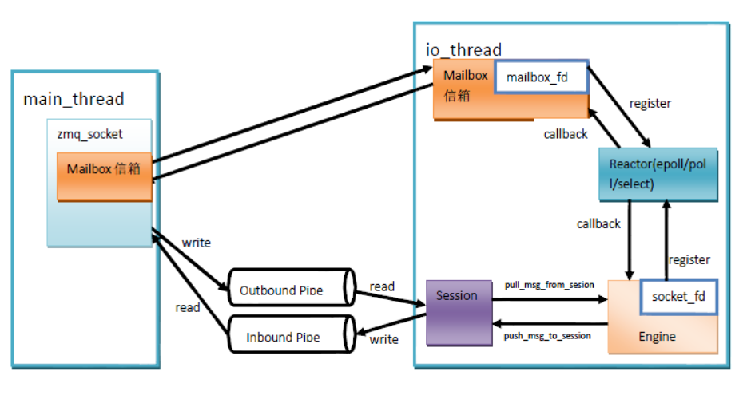
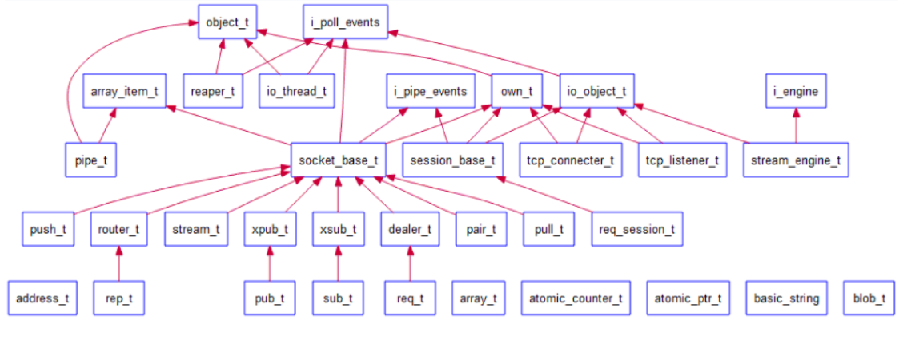
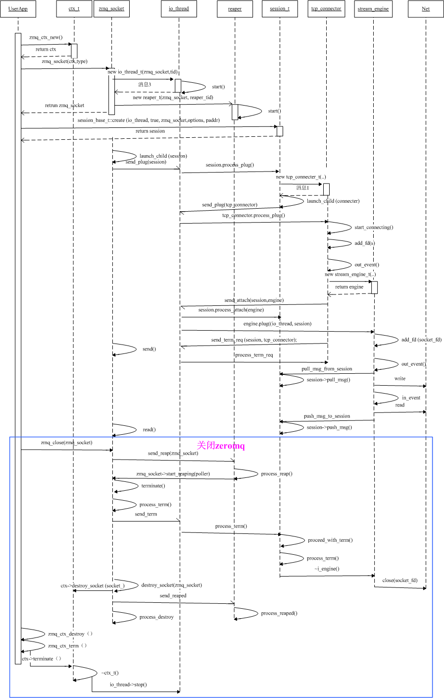

# ZeroMQ架构之一

---

## ZeroMQ整体架构
1. zeromq几乎所有I/O操作都是异步的，每个zmq i/o 线程（与实际线程不同）都有与之绑定的Poller，Poller采用经典的Reactor模式实现，Poller根据不同操作系统平台使用不同的网络I/O模型（select、poll、epoll、devpoll、kequeue等）。
2. 在zeromq中，zmq_socket也被看成是一个zmq io线程。每个线程内含一个信箱，用于线程与线程间传递命令（后面会详细讲），在创建zmq io线程时，会把信箱句柄加到Poller中，用于监听是否有命令到达。
3. 当client端开始发起连接或者server端开始监听时，会在主线程创建zmq_connector或者zmq_listener，主线程使用zmq_socket的mailbox发送命令给io线程，将其绑定到io线程中，io线程会把zmq_connector或者zmq_listener含有的句柄加入Poller中，以侦听读写事件。
4. Client端与Server端都是通过Session来管理连接和通信，一个session代表一次会话，每个Session都会关联到相应的读/写管道， 主线程收发消息只是分别从管道中读/写数据。Session并不实际跟kernel交换I/O数据，而是通过plugin到Session中的Engine来与kernel交换I/O数据。



## zmq类层次



1. object_t，主要用于发送命令和处理命令，所有继承object_t的子类都具备该类的功能
2. io_thread_t，内含一个poller，可监听句柄的读、写、异常状态，继承自object_t，具有接收命令、处理命令、发送命令的功能
3. io_object_t，可以获取一个io_thread_t的poller，从而具备poller功能，所有继承自该类的子类都具有pollere功能，可监听句柄的读、写、异常状态
4. reaper_t，zmq的回收线程
5. own_t，zmq的对象树结点，或者说多叉树的结点，其主要用于对象的销毁，可以想到，对象的销毁就是这棵树的销毁过程，必须要使用深度优先的算法来销毁。关于zmq对象树在Internal Architecture of libzmq有详细讲解
6. tcp_connector_t，zmq_socket的连接器，使用她来建立tcp连接
7. tcp_listener_t，zmq_socket的监听器
8. stream_engine，负责处理io事件中的一种----网络事件，把网络字节流转换成zeromq的msg_t消息传递给session_base_t。另外一些和版本兼容相关的杂务也stream_engine处理的。stream_engine_t处理完杂务，到session_base_t就只看见msg_t了
9. session_base_t，管理zmq_socket的连接和通信，主要与engine进行交换
10. socket_base_t，zeromq的socket，在zmq中，被当成一种特殊的”线程“，具有收发命令的功能

## zmq对象交互

序列图有助于理解对象状态变迁，下图描述的是客户端的对象状态变迁。zmq_socket以ZMQ_REQ模式实例化，用以进行tcp通信：

```cpp
void *requester = zmq_socket (context, ZMQ_REQ);
zmq_connect (requester, "tcp://localhost:5555");
```

