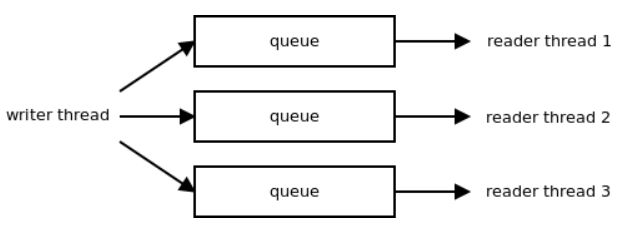

# ZeroMQ架构之二

---

## 关键路径

我们在性能优化的过程中发现有3个因素会对性能产生严重的影响：

1. 内存分配的次数
2. 系统调用的次数
3. 并发模型

但是，并不是每个内存分配或者每个系统调用都会对性能产生同样的影响。对于消息通信系统的性能，我们所感兴趣的是在给定的时间内能在两点间传送的消息数量。另外，我们可能会感兴趣的是消息从一点传送到另一点需要多久。

考虑到ØMQ被设计为针对长期连接的场景，因此建立一个连接或者处理一个连接错误所花费的时间基本上可忽略。这些事件极少发生，因此它们对总体性能的影响可以忽略不计。

代码库中某个一遍又一遍被频繁使用的部分，我们称之为关键路径。优化应该集中到这些关键路径上来。 让我们看一个例子：ØMQ在内存分配方面并没有做高度优化。比如，当操作字符串时，常常是在每个转化的中间阶段分配一个新的字符串。但是，如果我们严格审查关键路径——实际完成消息通信的部分——我们会发现这部分几乎没有使用任何内存分配。如果是短消息，那么每256个消息才会有一次内存分配（这些消息都被保存到一个单独的大内存块中）。此外，如果消息流是稳定的，在不出现流峰值的情况下，关键路径部分的内存分配次数会降为零（已分配的内存块不会返回给系统，而是不断的进行重用）。

## 内存分配
假设所有的基础组件都已经初始化完成，两点之间的一条连接也已经建立完成，此时要发送一条消息时只有一样东西需要分配内存：消息体本身。因此，要优化关键路径，我们就必须考虑消息体是如何分配的以及是如何在栈上来回传递的。

在高性能网络编程领域中，最佳性能是通过仔细地平衡消息的分配以及消息拷贝所带来的开销而实现的，这是常识（比如，http://hal.inria.fr/docs/00/29/28/31/PDF/Open-MX-IOAT.pdf 参见针对“小型”、“中型”、“大型”消息的不同处理）。对于小型的消息，拷贝操作比内存分配要经济的多。只要有需要，完全不分配新的内存块而直接把消息拷贝到预分配好的内存块上，这么做是有道理的。另一方面，对于大型的消息，拷贝操作比内存分配的开销又要昂贵的多。为消息体分配一次内存，然后传递指向分配块的指针，而不是拷贝整个数据。这种方式被称为“零拷贝”。

ØMQ以透明的方式同时处理这两种情况。一条ØMQ消息由一个不透明的句柄来表示。对于非常短小的消息，其内容被直接编码到句柄中。因此，对句柄的拷贝实际上就是对消息数据的拷贝。当遇到较大的消息时，它被分配到一个单独的缓冲区内，而句柄只包含一个指向缓冲区的指针。对句柄的拷贝并不会造成对消息数据的拷贝，当消息有数兆字节长时，这么处理是很有道理的（图24.3）。需要提醒的是，后一种情况里缓冲区是按引用计数的，因此可以做到被多个句柄引用而不必拷贝数据。

## 批量处理
前面已经提到过，在消息通信系统中，系统调用的数量太多的话会导致出现性能瓶颈。实际上，这个问题绝非一般。当需要遍历调用栈时会有不小的性能损失，因此，明智的做法是，当创建高性能的应用时应该尽可能多的去避免遍历调用栈。

为了发送4条消息，你不得不遍历整个网络协议栈4次（也就是，ØMQ、glibc、用户/内核空间边界、TCP实现、IP实现、以太网链路层、网卡本身，然后反过来再来一次）。

但是，如果你决定将这些消息集合到一起成为一个单独的批次，那么就只需要遍历一次调用栈了。这种处理方式对消息吞吐量的影响是巨大的：可大至2个数量级，尤其是如果消息都比较短小，数百个这样的短消息才能包装成一个批次。

另一方面，批量处理会对时延带来负面影响。我们来分析一下，比如，TCP实现中著名的Nagle算法。它为待发出的消息延迟一定的时间，然后将所有的数据合并成一个单独的数据包。显然，数据包中的第一条消息，其端到端的时延要比最后一条消息严重的多。因此，如果应用程序需要持续的低时延的话，常见做法是将Nagle算法关闭。更常见的是取消整个调用栈层次上的批量处理（比如，网卡的中断汇聚功能）。

但同样，不做批量处理就意味着需要大量穿越整个调用栈，这会导致消息吞吐量降低。似乎我们被困在吞吐量和时延的两难境地中了。

ØMQ尝试采用以下策略来提供一致性的低时延和高吞吐量。当消息流比较稀疏，不超过网络协议栈的带宽时，ØMQ关闭所有的批量处理以改善时延。这里的权衡是CPU的使用率会变得略高——我们仍然需要经常穿越整个调用栈。但是在大多数情况下，这并不是个问题。

当消息的速率超过网络协议栈的带宽时，消息就必须进行排队处理了——保存在内存中直到协议栈准备好接收它们。排队处理就意味着时延的上升。如果消息在队列中要花费1秒时间，端到端的时延就至少会达到1秒。更糟糕的是，随着队列长度的增长，时延会显著提升。如果队列的长度没有限制的话，时延就会超过任何限定值。

据观察，即使调整网络协议栈以追求最低的时延（关闭Nagle算法，关闭网卡中断汇聚功能，等等），由于受前文所述的队列的影响，时延仍然会比较高。

在这种情况下，积极的采取批量化处理是有意义的。反正时延已经比较高了，也没什么好顾虑的了。另一方面，积极的采用批量处理能够提高吞吐量，而且可以清空队列中等待的消息——这反过来又意味着时延将逐步降低，因为正是排队才造成了时延的上升。一旦队列中没有未发送的消息了，就可以关闭批量处理，进一步的改善时延。

我们观察到批量处理只应该在最高层进行，这是需要额外注意的一点。如果消息在最高层汇聚为批次，在低层次上就没什么可做批量处理的了，而且所有低层次的批量处理算法除了会增加总体时延外什么都没做。 我们从中学到了：在一个异步系统中，要获得最佳的吞吐量和响应时间，需要在调用栈的底层关闭批量处理算法，而在高层开启。仅在新数据到达的速率快于它们被处理的速率时才做批量处理。

## 架构概览

到目前为止，我们都专注于那些使ØMQ变得快速的通用性原则。从现在起，我们可以看一看实际的系统架构了

用户使用被称为“套接字”的对象同ØMQ进行交互。它们同TCP套接字很相似，主要的区别在于这里的套接字能够处理同多个对端的通信，有点像非绑定的UDP套接字。

套接字对象存在于用户线程中（见下一节的线程模型讨论）。除此之外，ØMQ运行多个工作者线程用以处理通信中的异步环节：从网络中读取数据、将消息排队、接受新的连接等等。

工作者线程中存在着多个对象。每一个对象只能由唯一的父对象所持有（所有权由图中一个简单的实线来标记）。与子对象相比，父对象可以存在于其他线程中。大多数对象直接由套接字sockets所持有。但是，这里有几种情况下会出现一个对象由另一个对象所持有，而这个对象又由socket所持有。我们得到的是一个对象树，每个socket都有一个这样的对象树。我们在关闭连接时会用到对象树，在一个对象关闭它所有的子对象前，任何对象都不能自行关闭。这样我们可以确保关闭操作可以按预期的行为那样正常工作。比如，在队列中等待发送的消息要先发送到网络中，之后才能终止发送过程。

大致来说，这里有两种类型的异步对象。有的对象不会涉及到消息传递，而有些需要。前者主要负责连接管理。比如，一个TCP监听对象在监听接入的TCP连接，并为每一个新的连接创建一个engine/session对象。类似的，一个TCP连接对象尝试连接到TCP对端，如果成功，它就创建一个engine/session对象来管理这个连接。如果失败了，连接对象会尝试重新建立连接。

而后者用来负责数据的传输。这些对象由两部分组成：session对象负责同ØMQ的socket交互，而engine对象负责同网络进行通信。session对象只有一种类型，而对于每一种ØMQ所支持的协议都会有不同类型的engine对象与之对应。因此，我们有TCP engine，IPC（进程间通信）engine，PGM engine（一种可靠的多播协议，参见RFC 3208），等等。engine的集合非常广泛——未来我们可能会选择实现比如WebSocket engine或者SCTP engine。

session对象同socket之间交换消息。可以由两个方向来传递消息，在每个方向上由一个pipe对象来处理。基本上来说，pipe就是一个优化过的用来在线程之间快速传递消息的无锁队列。

最后我们来看看context对象（在前一节中提到过，但没有在图中表示出来），该对象保存全局状态，所有的socket和异步对象都可以访问它。

## 并发模型

ØMQ需要充分利用多核的优势，换句话说就是随着CPU核心数的增长能够线性的扩展吞吐量。

以我们之前对消息通信系统的经验表明，采用经典的多线程方式（临界区、信号量等等）并不会使性能得到较大提升。事实上，就算是在多核环境下，一个多线程版的消息通信系统可能会比一个单线程的版本还要慢。有太多时间都花在等待其他线程上了，同时，引入了大量的上下文切换拖慢了整个系统。

针对这些问题，我们决定采用一种不同的模型。目标是完全避免锁机制，并让每个线程能够全速运行。线程间的通信是通过在线程间传递异步消息（事件）来实现的。内行人都应该知道，这就是经典的actor模式。

我们的想法是在每一个CPU核心上运行一个工作者线程——让两个线程共享同一个核心只会意味着大量的上下文切换而没有得到任何别的优势。每一个ØMQ的内部对象，比如说TCP engine，将会紧密地关联到一个特定的工作者线程上。反过来，这意味着我们不再需要临界区、互斥锁、信号量等等这些东西了。此外，这些ØMQ对象不会在CPU核之间迁移，从而可以避免由于缓存被污染而引起性能上的下降。

这个设计让很多传统多线程编程中出现的顽疾都消失了。然而，我们还需要在许多对象间共享工作者线程，这反过来又意味着必须要有某种多任务间的合作机制。这表示我们需要一个调度器，对象必须是事件驱动的，而不是在整个事件循环中来控制。我们必须考虑任意序列的事件，甚至非常罕见的情况也要考虑到。我们必须确保不会有哪个对象持有CPU的时间过长等等。

简单来说，整个系统必须是全异步的。任何对象都无法承受阻塞式的操作，因为这不仅会阻塞其自身，而且所有共享同一个工作者线程的其他对象也都会被阻塞。所有的对象都必须或显式或隐式的成为一种状态机。随着有数百或数千的状态机在并行运转着，你必须处理这些状态机之间的所有可能发生的交互，而其中最重要的就是——关闭过程。

事实证明，要以一种清晰的方式关闭一个全异步的系统是一个相当复杂的任务。试图关闭一个有着上千个运转着的部分的系统，其中有的正在工作中，有的处于空闲状态，有的正在初始化过程中，有的已经自行关闭了，此时极易出现各种竞态条件、资源泄露等诸如此类的情况。ØMQ中最为复杂的部分肯定就是这个关闭子系统了。快速检查一下bug跟踪系统的记录显示，约30%到50%的bug都同关闭有某种联系。

我们从中学到的是：当要追求极端的性能和可扩展性时，考虑采用actor模型。在这种情况下这几乎是你唯一的选择。不过，如果不使用像Erlang或者ØMQ这种专门的系统，你将不得不手工编写并调试大量的基础组件。此外，从一开始就要好好思考关于系统关闭的步骤。这将是代码中最为复杂的部分，而如果你没有清晰的思路该如何实现它，你可能应该重新考虑在一开始就使用actor模型。

## 无锁算法

最近比较流行使用无锁算法。它们是用于线程间通信的一种简单机制，同时并不会依赖于操作系统内核提供的同步原语，如互斥锁和信号量。相反，它们通过使用CPU原子操作来实现同步，比如原子化的CAS指令（比较并交换）。我们应该理解清楚的是它们并不是字面意义上的无锁——相反，锁机制是在硬件层面实现的。

ØMQ在pipe对象中采用无锁队列来在用户线程和ØMQ的工作者线程之间传递消息。关于ØMQ是如何使用无锁队列的，这里有两个有趣的地方。

首先，每个队列只有一个写线程，也只有一个读线程。如果有1对多的通信需求，那么就创建多个队列。鉴于采用这种方式时队列不需要考虑对写线程和读线程的同步（只有一个写线程，也只有一个读线程），因此可以以非常高效的方式来实现。

其次，尽管我们意识到无锁算法要比传统的基于互斥锁的算法更加高效，CPU的原子操作开销仍然非常高昂（尤其是当CPU核心之间有竞争时），对每条消息的读或者写都采用原子操作的话，效率将低于我们所能接受的水平。

提高速度的方法——再次采用批量处理。假设你有10条消息要写入到队列。比如，可能会出现当你收到一个网络数据包时里面包含有10条小型的消息的情况。由于接收数据包是一个原子事件，你不能只接收一半，因此这个原子事件导致需要写10条消息到无锁队列中。那么对每条消息都采用一次原子操作就显得没什么道理了。相反，你可以让写线程拥有一块自己独占的“预写”区域，让它先把消息都写到这里，然后再用一次单独的原子操作，整体刷入队列。

同样的方法也适用于从队列中读取消息。假设上面提到的10条消息已经刷新到队列中了。读线程可以对每条消息采用一个原子操作来读取，但是，这种做法过于重量级了。相反，读线程可以将所有待读取的消息用一个单独的原子操作移动到队列的“预读取”部分。之后就可以从“预读”缓存中一条一条的读取消息了。“预读取”部分只能由读线程单独访问，因此这里没有什么所谓的同步需求。

左边的箭头展示了如何通过简单地修改一个指针来将预写入缓存刷新到队列中的。右边的箭头展示了队列的整个内容是如何通过修改另一个指针来移动到预读缓存中的。

